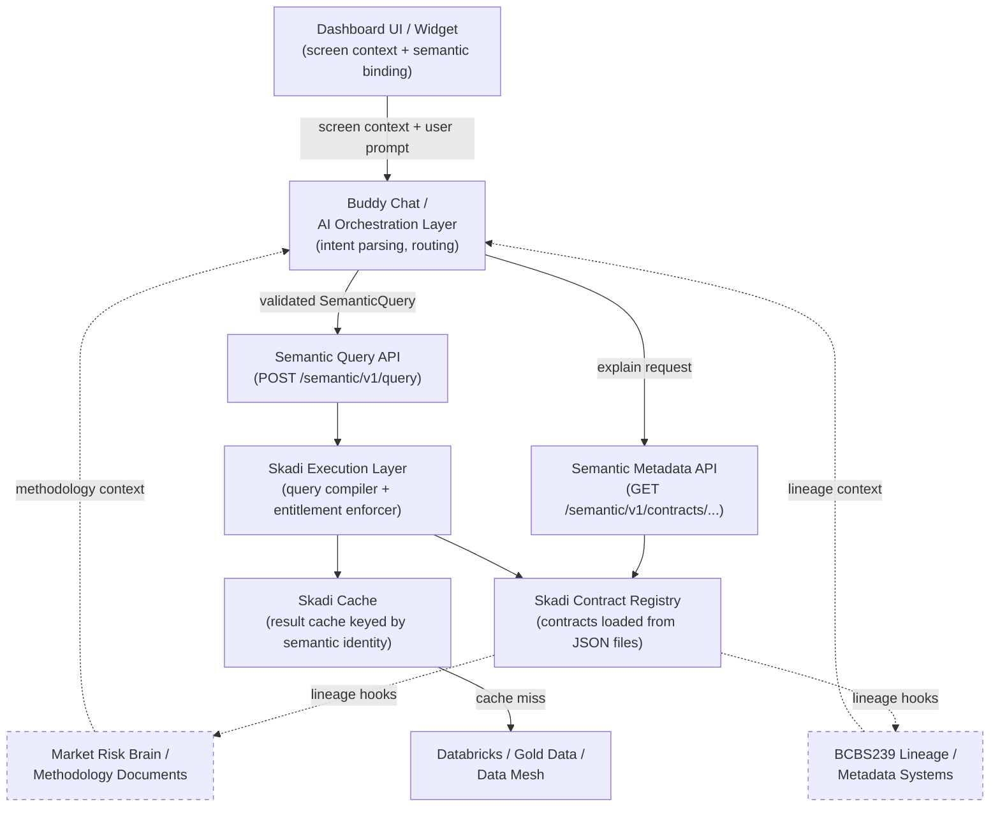

# ADR-012: Buddy Chat Interrogates Semantic Model for Query Execution and Semantic Explanation

**Status:** Accepted  
**Date:** 2026-05-17  
**Owners:** engineering, architecture, data governance  
**Related ADRs:** ADR-004, ADR-005, ADR-006, ADR-007, ADR-008, ADR-010  
**Supersedes:** —

---

## 1. Context

### Problem

Skadi is evolving from a SQL/query acceleration and caching layer into a governed semantic
execution and dashboard platform. The dashboard architecture includes a "buddy chat" or AI
assistant embedded in the UI. This assistant must help users understand what they are seeing,
ask follow-up questions, and safely request new views of governed data.

Without a firm architectural principle, the buddy chat risks becoming an independent source of
business meaning — answering questions from prompt memory, hardcoded rules, or LLM general
knowledge. In a regulated financial context, this is unacceptable: different surfaces would give
different definitions of VaR, Legal Entity, or ES depending on which LLM answered and when.

This is the problem of **AI meaning sprawl**: the LLM becomes a shadow semantic layer, diverging
silently from the governed model.

### Background

- The semantic query layer (ADR-004) defines governed query execution via `SemanticQuery` records
- Semantic contracts (ADR-005, ADR-011) are the source of truth for metric definitions, dimension
  labels, access policy, and cache behavior
- The dashboard brick model (ADR-006) defines composable governed dashboards, including a `chat`
  brick type
- ADR-007 established that AI chat must integrate exclusively through the semantic query layer
  and must never generate raw SQL
- ADR-007 covered the **query execution** path; it did not fully address the **semantic
  explanation** path: "What is VaR?", "What grain is this data?", "Why can't I drill into desks?"
- Semantic contracts as defined in ADR-005 carry query metadata but not the business-facing
  metadata needed to answer explanation questions: intended usage, common caveats, lineage hooks,
  entitlement rationale, or output shape descriptions

This ADR extends the governance model from query execution to semantic explanation, and defines
the buddy chat's responsibility boundary in both directions.

---

## 2. Decision

The buddy chat must interrogate the governed semantic model for **both** query execution and
semantic explanation. It must not answer business-definition questions from prompt memory,
hardcoded rules, or disconnected chatbot-specific knowledge.

### 2.1 Two interaction modes

**Mode 1 — Query execution**

The user requests a new view of data. The buddy chat resolves the request to a governed
`SemanticQuery` and executes it through the semantic layer. No raw SQL is generated.

Examples:
- "Show me VaR by Legal Entity."
- "Break this down by Risk Class."
- "Compare today versus yesterday."
- "Filter this to CIB."
- "Can I group this by desk?"

This path follows ADR-007 (intent resolution → semantic query execution → response generation).

**Mode 2 — Semantic explanation**

The user asks what something means, what is available, or why a constraint applies. The buddy
chat retrieves the answer from semantic contract metadata and dashboard context, not from LLM
general knowledge.

Examples:
- "What is VaR?"
- "What VaR measure is this chart showing?"
- "What does Legal Entity mean here?"
- "What grain is this data?"
- "What filters are currently applied?"
- "Where does this number come from?"
- "Why can't I drill into desk-level detail?"

This path calls a semantic metadata API, retrieves the governing contract definition, and
uses that definition as the authoritative input to the LLM's natural language response.

### 2.2 The governing constraint

> **The buddy chat may summarize, translate, and contextualize semantic definitions for users,
> but it must not maintain independent business definitions outside the governed semantic model.**

Summarization and contextualizing are permitted and expected — they are how an LLM adds value
over raw metadata output. Independently authoring definitions, inventing grain assumptions, or
filling in missing metadata from LLM general knowledge are not permitted.

If the semantic model does not define something, the buddy chat must say so. It must not
substitute a general financial-domain definition for an absent governed definition.

### 2.3 Semantic contract metadata requirements

Semantic contracts must expose explainable metadata sufficient for both modes. The following
fields are required or explicitly planned for contracts:

| Metadata field | Mode | Notes |
|---|---|---|
| `measure.label` | explanation | Display name |
| `measure.description` | explanation | Business definition |
| `measure.intended_usage` | explanation | When to use this measure vs. alternatives |
| `measure.caveats` | explanation | Known ambiguities, common misinterpretations |
| `dimension.label` | both | Display name |
| `dimension.filterable` | both | Whether filtering is permitted |
| `dimension.groupable` | both | Whether grouping is permitted |
| `dimension.description` | explanation | Business definition |
| `grain` | explanation | What one row represents |
| `valid_grouping_paths` | both | Which dimension combinations are meaningful |
| `entitlement_behavior` | both | What is restricted and why |
| `lineage_hooks` | explanation | References to external lineage systems |
| `output_shapes` | both | What result structures are possible |
| `contract_version` | explanation | Which definition is active |
| `ownership` | explanation | Who owns this definition |

Not all fields must be present on Day 1. Phase 1 metadata Q&A uses the fields already present
in Lane D contracts. Later phases add fields as the buddy chat's explanation capability grows.

### 2.4 Screen-context awareness

When a user asks "What is this chart showing?", the buddy chat must know:
- which widget is active
- which semantic contract powers it
- which measures and dimensions are bound
- which filters are applied
- which contract version is active
- which entitlement scope applies to the user

The dashboard UI must pass this screen context with every buddy chat request. The buddy chat
must not guess or infer the active widget state from conversation history alone.

### 2.5 Entitlement-awareness

The buddy chat must not suggest drilldowns, dimensions, measures, or data scopes that the user
is not permitted to access. If a drilldown path exists but is restricted, the assistant must
explain that access is limited by entitlement policy — it must not silently omit the drilldown
or claim it does not exist.

### 2.6 Semantic metadata API surface

Skadi must expose semantic metadata APIs. The following endpoints are required or must have
explicit extension points:

| Endpoint | Purpose |
|---|---|
| `GET /semantic/v1/contracts` | List all contracts accessible to the principal |
| `GET /semantic/v1/contracts/{name}` | Get full contract definition (existing — skadi#68) |
| `GET /semantic/v1/contracts/{name}/measures` | List measures with labels and descriptions |
| `GET /semantic/v1/contracts/{name}/measures/{measure}` | Get measure definition |
| `GET /semantic/v1/contracts/{name}/dimensions` | List dimensions with groupable/filterable flags |
| `GET /semantic/v1/contracts/{name}/dimensions/{dim}` | Get dimension definition |
| `POST /semantic/v1/contracts/{name}/explain` | Explain a contract in natural language context |
| `POST /semantic/v1/widgets/{widgetId}/explain` | Explain a bound widget's semantic state |
| `POST /semantic/v1/query/validate` | Validate a semantic request before execution |
| `POST /semantic/v1/query` | Execute a semantic query (existing) |

The read-only metadata endpoint introduced in skadi#68 (`GET /contracts/{contractId}`) is the
first implementation. Subsequent stories extend the surface.

### 2.7 Lineage and document integration

The semantic contract is the semantic anchor for any explanation. Deeper explanation may require
external sources. These are accessed through **lineage hooks** on the contract — not hardcoded
into the buddy chat.

Planned integration points:
- Market Risk Brain / methodology documents
- BCBS239 lineage database
- Databricks metadata catalog
- Pipeline event logs
- Data-quality results

In Phase 1 these hooks are stubs — the contract carries a reference; resolution is a future story.

---

## 3. Core Principle

> **The semantic model is the source of truth for structured business meaning. The buddy chat
> is the conversational interface to that meaning.**

This principle has the following corollaries:

1. If the semantic model defines VaR, the buddy chat answers "What is VaR?" using that definition.
2. If the semantic model does not define something, the buddy chat says it is not governed — it
   does not substitute a general financial definition.
3. If a measure or dimension is restricted by entitlement, the buddy chat explains the
   restriction — it does not pretend the concept does not exist.
4. If the semantic model is updated (contract version change), the buddy chat's answers update
   automatically — there is no separate knowledge base to keep in sync.

---

## 4. Rationale

### Dashboard explainability

Dashboards that cannot explain themselves require tribal knowledge to operate. A governed semantic
explanation surface means any user can ask "What is this number?" and receive a consistent,
traceable answer — the same answer whether they ask today or in six months after a contract
version bump.

### Governed AI

AI assistants that maintain independent knowledge bases are a governance liability. In a
regulated environment, a VaR definition that diverges between the governed contract and the AI
assistant creates regulatory risk. Constraining the buddy chat to the semantic model eliminates
this class of divergence structurally, not by prompt engineering.

### Entitlement safety

Entitlements are enforced at the semantic query layer (ADR-007). An AI assistant that routes
all queries through that layer cannot bypass entitlements by asking differently. A buddy chat
that generates raw SQL or queries external systems would require its own entitlement enforcement —
a second control surface that can drift from the first.

### Avoidance of AI meaning sprawl

Without this decision, the buddy chat will inevitably accumulate independent answers to
frequently-asked business-definition questions. These accumulate in prompt engineering, system
prompts, or few-shot examples — invisible to governance review. This decision prevents that
accumulation by requiring all answers to route through the semantic model.

### Semantic contract design

Requiring explanation metadata on contracts creates a beneficial forcing function: contract
authors must articulate what their measures mean in business terms, not just in SQL expressions.
This improves contract quality for all consumers, not just the buddy chat.

### Skadi cache and execution architecture

Routing all buddy-chat queries through the semantic query layer means AI-driven queries benefit
from Skadi's cache (ADR-010). A question asked by the buddy chat that resolves to a
`SemanticQuery` previously issued by a dashboard brick returns a cached result. There is no
separate AI cache to maintain.

---

## 5. Consequences

### Positive

- Buddy chat answers are consistent with governed dashboard numbers — same contracts, same cache
- All buddy-chat queries are auditable (`source=buddy_chat` in audit log)
- Semantic contract quality improves as explanation metadata becomes a required field
- LLM context window for explanation calls is scoped to the active contract — small and cacheable
- Entitlement enforcement is structural — the buddy chat cannot suggest inaccessible data
- Dashboard explainability becomes a first-class capability, not a documentation afterthought

### Negative / Risks

See Section 8 (Risks and Mitigations) for the full risk register.

### Operational Impact

- Semantic contracts gain new required fields (description, caveats, intended_usage) — contract
  authors must supply them; a lint rule should flag missing explanation fields
- The semantic metadata API surface grows beyond the existing read-only endpoint (skadi#68)
- Screen context must be passed with every buddy-chat request — the dashboard UI must be designed
  to capture and emit this context
- A `stub` metadata API implementation must exist for local development without a live contract
  registry

---

## 6. Non-Goals

- The buddy chat is not the semantic layer.
- The buddy chat is not the owner of business definitions.
- The buddy chat does not independently define VaR, ES, Legal Entity, LOB, Risk Class, or
  other business concepts.
- The buddy chat does not bypass semantic contracts to query raw governed tables directly.
- This decision does not require building a full ontology engine.
- This decision does not require all lineage and document integrations to be complete in Phase 1.
- This decision does not require the buddy chat to understand every possible natural language
  question — unsupported questions should return a clear "I don't have a governed answer for
  that" response.

---

## 7. Implementation Guidance

### Phase 1 — Metadata Q&A

**Goal:** The buddy chat can answer "What is X?" questions using governed contract definitions.

- Extend semantic contracts with `description`, `intended_usage`, `caveats`, `ownership` on
  measures and dimensions (may be optional/nullable in Phase 1; flagged missing by lint)
- Implement `GET /semantic/v1/contracts/{name}/measures/{measure}` and equivalent dimension
  endpoint
- Buddy chat routes "What is [measure]?" questions to these endpoints and uses the response as
  LLM context, not as general knowledge

**Example routing — Phase 1:**

| User question | Routing |
|---|---|
| "What is VaR?" | Fetch `var` measure definition from active contract; LLM narrates the governed description |
| "What does Legal Entity mean here?" | Fetch `legal_entity` dimension definition; LLM narrates |
| "What grain is this data?" | Fetch contract `grain` field; LLM narrates |

### Phase 2 — Contract validation

**Goal:** The buddy chat can tell users what is possible before executing a query.

- Implement `POST /semantic/v1/query/validate` — validate a `SemanticQuery` without executing it
- Buddy chat calls validate before proposing a drilldown; if rejected (entitlement or invalid
  grouping path), it explains why before the user invokes it
- Implement `GET /semantic/v1/contracts/{name}/dimensions` with `groupable` and `filterable` flags
  so the buddy chat can answer "What can I group this by?"

**Example routing — Phase 2:**

| User question | Routing |
|---|---|
| "Can I group this by desk?" | Validate `group_by=desk` for active contract; return result with explanation |
| "What filters are available?" | Fetch filterable dimensions from active contract |
| "What can I compare this over?" | Fetch groupable temporal dimensions |

### Phase 3 — Governed query execution

**Goal:** The buddy chat can execute new governed queries from conversational prompts.

- Implement the full intent resolution → semantic query → response generation flow (ADR-007)
- Screen context is passed with intent resolution; the resolver scopes contract candidates to the
  active widget's contract family
- All execution goes through `POST /semantic/v1/query` — same endpoint, same cache, same audit log
- `source=buddy_chat` on all audit events

**Example routing — Phase 3:**

| User question | Routing |
|---|---|
| "Show me VaR by Legal Entity" | Intent resolution → `SemanticQuery` → execute → narrate result |
| "Compare today versus yesterday" | Intent resolution → `SemanticQuery` with date filter → execute → narrate |
| "Filter this to CIB" | Intent resolution → `SemanticQuery` with CIB filter → execute → narrate |

### Phase 4 — Lineage and methodology explanation

**Goal:** The buddy chat can explain where numbers come from using external lineage hooks.

- Contracts expose `lineage_hooks` with references to Market Risk Brain, BCBS239, or Databricks
  lineage identifiers
- Buddy chat resolves hooks and incorporates lineage context into explanation responses
- Data-quality results and pipeline event logs are accessible through hooks for "Why is this
  number different from yesterday?" questions
- This phase does not change the contract governance model — it adds depth to explanation, not
  new query authority

---

## 8. Architecture Diagram

Dashed lines indicate Phase 4 integrations (lineage hooks — not required for Phases 1–3).

---

## 9. Risks and Mitigations

| Risk | Impact | Mitigation |
|---|---|---|
| **AI meaning sprawl** — LLM uses general knowledge to fill gaps in contract metadata | Definitions diverge from governed model; regulatory risk | Require the buddy chat to state when a concept is not in the semantic model; do not substitute general definitions |
| **Stale semantic definitions** — contract metadata is outdated; buddy chat explains obsolete definitions | Users receive incorrect business context | Contract version is surfaced in all explanation responses; contracts are code, changes go through PR review |
| **Entitlement leakage** — buddy chat suggests restricted dimensions or data scopes | Unauthorized data discovery | All suggested drilldowns pass through `POST /semantic/v1/query/validate`; the contract registry enforces entitlement structurally |
| **Raw SQL bypass** — buddy chat generates SQL for questions the semantic model cannot answer | Governance and audit bypass | LLM output is constrained to `SemanticQuery` records (ADR-007); no path exists to execute raw SQL through the buddy chat API |
| **Overloading Skadi with chatbot concerns** — semantic execution layer accumulates chatbot-specific logic | Architectural drift; semantic layer becomes chatbot-specific | The metadata API surface is general-purpose (contract introspection for any consumer); buddy chat is a consumer, not a special case |
| **Incomplete lineage integration** — explanations reference lineage but hooks are not resolved | Partial answers; user confusion | Phase 4 lineage hooks are explicit extension points; if unresolved, the buddy chat states lineage context is not yet available |
| **Explanation quality degrades with large contracts** — context window for LLM explanation grows with contract size | Slow, expensive, or truncated responses | Scope context window to the active widget's measure/dimension subset, not the full contract |
| **Missing explanation metadata** — contracts have no `description` or `caveats` on measures | Buddy chat cannot answer "What is X?" | Lint rule flags contracts missing explanation fields; Phase 1 accepts null/absent fields with a graceful "not yet documented" response |

---

## 10. Example Question Routing

| User question | Mode | Routing path |
|---|---|---|
| "What is VaR?" | Explanation | Fetch `var` measure definition from active contract → LLM narrates governed description |
| "What VaR measure is this chart showing?" | Explanation | Read screen context → fetch active widget's bound measure → LLM narrates |
| "What does Legal Entity mean here?" | Explanation | Fetch `legal_entity` dimension definition from active contract → LLM narrates |
| "What grain is this data?" | Explanation | Fetch `grain` from active contract → LLM narrates |
| "What filters are currently applied?" | Explanation | Read screen context (active widget state) → list applied filters with dimension labels |
| "Where does this number come from?" | Explanation | Fetch contract lineage hooks → resolve methodology reference → LLM narrates (Phase 4) |
| "Why can't I drill into desk-level detail?" | Explanation | Validate `group_by=desk` → return entitlement rejection explanation |
| "Show me VaR by Legal Entity." | Execution | Intent resolution → `SemanticQuery{measure=var, group_by=legal_entity}` → execute → narrate |
| "Break this down by Risk Class." | Execution | Intent resolution → add `group_by=risk_class` → validate → execute → narrate |
| "Compare today versus yesterday." | Execution | Intent resolution → `SemanticQuery` with date filter pair → execute → narrate |
| "Filter this to CIB." | Execution | Intent resolution → add `filter{lob=CIB}` → validate → execute → narrate |
| "Can I group this by desk?" | Validation | `POST /semantic/v1/query/validate` with `group_by=desk` → return result with explanation |
| "What can I group this by?" | Explanation | Fetch `groupable=true` dimensions from active contract → list with labels |
| "What related measures exist?" | Explanation | Fetch all measures from active contract → LLM summarizes |
| "Is there a drilldown contract?" | Explanation | Fetch contracts linked from active contract → list if present |

---

## 11. Alternatives Considered

| Option | Why Rejected |
|---|---|
| Allow LLM to answer from general knowledge when contract metadata is absent | Produces ungoverned definitions that diverge from the semantic model; violates the core principle |
| Build a separate knowledge base for business definitions alongside contracts | Two sources of truth for the same concepts; maintenance burden; synchronization drift risk |
| Require all explanation metadata in Phase 1 contracts | Too high a barrier; blocks buddy chat delivery while contracts mature; phased approach is preferred |
| Route explanation questions to an external documentation system (not via contract hooks) | Buddy chat acquires dependency on external systems without semantic anchoring; definitions are not contract-versioned |
| Separate buddy chat application outside Skadi | Governance would be duplicated; AI queries would not benefit from Skadi's cache (ADR-010); audit trail would be split |

---

## 12. Fitness Functions / Enforcement

- Integration test: buddy chat explanation request for a known measure → response cites the
  contract's `description` field, not LLM general knowledge (verified via stub LLM returning
  only the contract metadata as context)
- Integration test: buddy chat suggests a dimension the principal cannot access → suggestion is
  rejected and explanation cites entitlement policy before the user requests it
- Integration test: buddy chat query execution request → `source=buddy_chat` appears in audit log
- Contract lint rule: measures and dimensions without `description` fields emit a warning (not
  build failure in Phase 1; build failure in Phase 3+)
- API contract test: `GET /semantic/v1/contracts/{name}/measures/{measure}` returns all required
  explanation metadata fields (null-allowed in Phase 1 with explicit nullable annotation)

> No automated ArchUnit enforcement in Phase 1. Review-only for LLM context construction to
> confirm contract metadata is always included.

---

## 13. Open Questions

- Q1: When contract explanation metadata is absent (null `description`), should the buddy chat
  say "this measure is not yet documented in the governed model" or remain silent about the gap?
  Recommendation: always state the gap explicitly — silence implies the definition exists.
- Q2: Should the buddy chat show the user which contract version powered an explanation ("This
  definition is from contract VaR v1.2.0, last updated 2026-04-10")? This aids trust but adds
  UI surface.
- Q3: How does multi-turn conversation state interact with screen context? If the user navigates
  to a different widget mid-conversation, does the semantic context reset?
- Q4: For Phase 4 lineage hooks — should hook resolution be synchronous (blocking explanation
  response) or asynchronous (explanation streams in, lineage appends when resolved)?
- Q5: Should the buddy chat expose a "What can I ask about this dashboard?" discovery prompt that
  enumerates available measures, dimensions, and valid grouping paths for the active screen?

---

## 14. References / Related Decisions

| Document | Relationship |
|---|---|
| [ADR-004](ADR-004-semantic-query-layer.md) | Defines the semantic query layer that the buddy chat executes through |
| [ADR-005](ADR-005-semantic-contracts.md) | Defines the contract format; this ADR extends the required metadata fields |
| [ADR-006](ADR-006-dashboard-brick-model.md) | Defines the `chat` brick type that hosts the buddy chat surface |
| [ADR-007](ADR-007-ai-chat-integration.md) | Defines the three-endpoint integration for query execution; this ADR adds semantic explanation as a fourth concern |
| [ADR-010](ADR-010-cache-positioning.md) | Cache architecture; buddy-chat queries benefit from the same cache as brick queries |
| [ADR-011](ADR-011-contract-definition-format-json-canonical.md) | JSON canonical format for contracts that carry the explanation metadata this ADR requires |
| [DQR-003](../dqr/DQR-003-lineage-market-risk-brain-seams.md) | Open design question for Market Risk Brain and lineage integration seams (Phase 4) |
