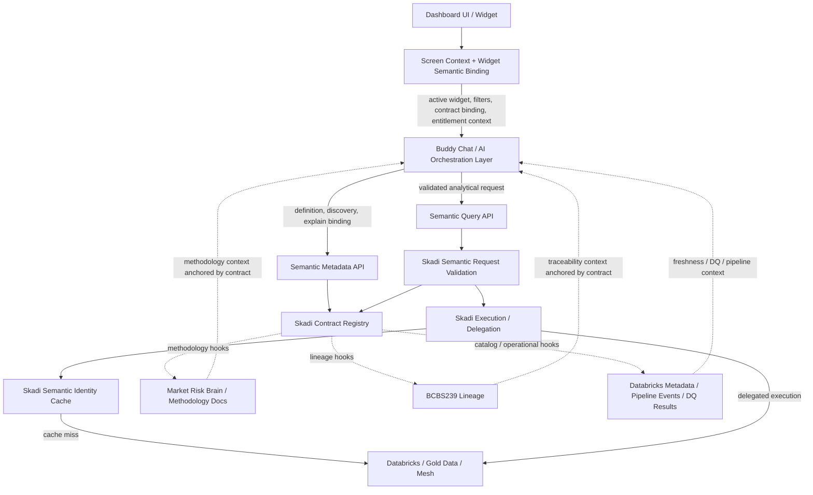

# ADR-012: Milestone Decision — Buddy Chat Interrogates Semantic Model for Query Execution and Semantic Explanation

**Status:** Accepted  
**Date:** 2026-05-17  
**Owners:** engineering, architecture, data governance  
**Related ADRs:** ADR-004, ADR-005, ADR-006, ADR-007, ADR-008, ADR-010, ADR-011  
**Supersedes:** —

---

## 1. Context

### Problem

Skadi is evolving from a SQL/query acceleration and caching layer into a governed semantic execution and dashboard platform. The dashboard architecture includes a buddy chat / AI assistant embedded in the UI. This assistant must help users understand what they are seeing, ask follow-up questions, discover available analytical paths, and safely request new views of governed data.

Without a firm architectural boundary, the buddy chat risks becoming an independent source of business meaning: answering from prompt memory, hardcoded rules, disconnected chatbot-specific knowledge, generic LLM knowledge, or raw SQL examples. In a regulated market-risk context, that is unacceptable. Different surfaces could give different definitions of VaR, ES, Legal Entity, LOB, Risk Class, or other core concepts depending on which assistant answered and when.

This is the problem of **AI meaning sprawl**: the uncontrolled emergence of separate business definitions in prompts, chatbot tools, hardcoded rules, local documentation snippets, unmanaged knowledge bases, or raw SQL examples that silently drift away from governed semantic contracts.

### Background

- ADR-004 defines the semantic query layer as the governed interface for analytical requests.
- ADR-005 defines semantic contracts as the governed unit of semantic meaning, query shape, and execution constraints.
- ADR-006 defines dashboard bricks as governed UI components bound to semantic contracts, including a chat surface.
- ADR-007 defines AI chat integration points and prevents AI chat from generating raw SQL or bypassing the semantic layer.
- ADR-008 captures the broader semantic strategy milestone and the expectation that Skadi evolves toward governed semantic execution.
- ADR-010 defines cache positioning and semantic-identity-based cache reuse.
- ADR-011 defines the JSON canonical contract format that will carry explainable semantic metadata.

ADR-007 primarily covered the **query execution** path. This ADR extends the governance model to the **semantic explanation** path: questions such as “What is VaR?”, “What grain is this data?”, “What filters are applied?”, “Why can’t I drill into desk-level detail?”, and “Where does this number come from?”

The decision is not that the buddy chat becomes the semantic layer. The decision is that the buddy chat becomes the conversational interface to the governed semantic layer.

---

## 2. Decision

The buddy chat must interrogate the governed semantic model for **both**:

1. **Semantic query execution** — converting a user request into an approved semantic request that is validated and executed through Skadi / the semantic execution layer.
2. **Semantic explanation / metadata interrogation** — answering questions about definitions, grain, filters, dimensions, measures, lineage hooks, entitlement behavior, output shapes, dashboard bindings, ownership, intended usage, and caveats using governed semantic metadata.

> **The buddy chat may summarize and contextualize semantic definitions, but must not maintain independent business definitions outside the governed semantic model.**

The buddy chat may translate, simplify, compare, and contextualize semantic definitions for users. It may not independently author definitions, infer missing grain, invent lineage, bypass entitlement rules, or substitute generic financial-domain knowledge when a governed semantic definition is absent or incomplete.

If the semantic model does not define something, the buddy chat must state that the concept is not currently governed or not currently documented in the active semantic model. It must not fill the gap with LLM general knowledge.

---

## 3. Core Principle

> **The semantic model is the source of truth for structured business meaning. The buddy chat is the conversational interface to that meaning.**

Corollaries:

1. If the semantic model defines VaR, the buddy chat answers “What is VaR?” using that active governed definition.
2. If the semantic model does not define something, the buddy chat says so rather than substituting a generic definition.
3. If a measure, dimension, grouping path, or drilldown is restricted by entitlement, the buddy chat explains the restriction in safe terms and does not leak restricted values or details.
4. If a semantic contract version changes, buddy-chat explanations change automatically because they are derived from the active contract, not from a separate chatbot knowledge base.
5. If a user asks an analytical question, the buddy chat routes through semantic metadata, validation, and approved query execution rather than arbitrary SQL against raw governed tables.

---

## 4. Interaction Modes

### 4.1 Mode 1 — Semantic Query Execution

The user requests a new governed analytical view of data. The buddy chat resolves the natural language request into a semantic request, validates it, and executes it through the governed semantic query path.

Examples:

- “Show me VaR by Legal Entity.”
- “Break this down by Risk Class.”
- “Compare today versus yesterday.”
- “Filter this to CIB.”
- “Can I group this by desk?”

Execution requirements:

- Select an approved semantic contract or contract family.
- Validate requested measures, dimensions, filters, grain, output shape, and entitlement scope.
- Execute only through Skadi / semantic execution APIs.
- Reuse Skadi semantic identity, cache, audit, and entitlement infrastructure.
- Record audit source such as `source=buddy_chat`.
- Never generate arbitrary SQL against raw tables for governed analytical questions.

### 4.2 Mode 2 — Semantic Explanation / Metadata Interrogation

The user asks what something means, what is available, or why a constraint applies. The buddy chat retrieves the answer from semantic contract metadata and dashboard context, then uses the LLM only to narrate the governed answer.

Examples:

- “What is VaR?”
- “What VaR measure is this chart showing?”
- “What does Legal Entity mean here?”
- “What grain is this data?”
- “What filters are currently applied?”
- “Where does this number come from?”
- “Why can’t I drill into desk-level detail?”

Explanation requirements:

- Retrieve active screen context when the question references “this chart,” “this number,” “here,” or “current filters.”
- Retrieve the active semantic contract, measure, dimension, grain, entitlement, and version metadata.
- Use contract metadata as authoritative LLM context.
- Include caveats, intended usage, ownership, and version when relevant.
- State clearly when a governed definition or lineage hook is missing.

---

## 5. Semantic Contract Metadata Requirements

Semantic contracts are not only query definitions. They must carry enough business-facing metadata to support explanation, discovery, validation, entitlement-safe guidance, and governed exploration.

The following metadata fields are required now or explicitly planned as contract extensions:

| Metadata field | Applies to | Purpose |
|---|---|---|
| `measure.label` | Explanation / UI | Display name |
| `measure.description` | Explanation | Business definition |
| `measure.intended_usage` | Explanation / validation | When to use this measure vs. alternatives |
| `measure.caveats` | Explanation | Known ambiguities, exclusions, or common misinterpretations |
| `dimension.label` | Explanation / UI | Display name |
| `dimension.description` | Explanation | Business definition |
| `dimension.filterable` | Discovery / validation | Whether filtering is permitted |
| `dimension.groupable` | Discovery / validation | Whether grouping is permitted |
| `grain` | Explanation / validation | What one row or result observation represents |
| `valid_filters` | Discovery / validation | Filters supported by the contract |
| `valid_grouping_paths` | Discovery / validation | Dimension combinations that are meaningful and allowed |
| `entitlement_behavior` | Explanation / validation | What is restricted, why, and how safe denials should be expressed |
| `lineage_hooks` | Explanation | References to lineage, methodology, catalog, pipeline, or DQ systems |
| `output_shapes` | Discovery / execution | Supported response structures, such as table, time series, breakdown, or comparison |
| `contract_version` | Explanation / audit | Active definition and execution version |
| `ownership` | Governance | Owning team, steward, or accountable party |
| `status` / `effective_dates` | Governance | Lifecycle and temporal validity of definitions |

Not all fields must be populated on Day 1. Phase 1 may allow null or missing explanation fields, but missing fields must be visible through lint warnings and graceful buddy-chat responses such as “this measure is not yet documented in the governed model.”

---

## 6. Screen-Context Awareness

The buddy chat must be screen-context aware. When a user asks “What is this chart showing?”, the assistant must know:

- which dashboard is active
- which widget is active
- which semantic contract powers the widget
- which measures and dimensions are bound
- which filters are applied, including dashboard-level, widget-level, inherited, and user-applied filters
- which output shape is currently displayed
- which contract version is active
- which entitlement scope applies to the user

The dashboard UI runtime and presentation metadata layer must pass this context with buddy-chat requests. The buddy chat must not guess the active widget state from conversation history alone.

---

## 7. Entitlement Awareness

The buddy chat must be entitlement-aware for both metadata discovery and query execution.

It must not suggest drilldowns, dimensions, measures, filters, output shapes, or data scopes that the user is not permitted to access. If a drilldown path exists but is restricted, the assistant should explain that access is limited by entitlement policy without leaking restricted values or restricted business details.

Entitlement filtering must apply to:

- contract listing
- measure and dimension discovery
- grouping and filter suggestions
- validation responses
- query execution
- explanation responses that reveal whether a restricted concept exists

Safe denial examples:

- “Desk-level grouping is not available for your current access scope on this contract.”
- “This widget is governed at Legal Entity grain; desk-level drilldown is either not supported by the active contract or not available to your entitlement scope.”
- “I can explain the current Legal Entity view, but I cannot expose restricted desk-level detail from this dashboard context.”

---

## 8. Semantic Metadata and Query API Direction

Skadi should expose semantic metadata APIs and semantic query APIs. Initial APIs should include, or leave explicit extension points for:

| Endpoint / capability | Purpose |
|---|---|
| `GET /semantic/v1/contracts` | List accessible contracts for the principal |
| `GET /semantic/v1/contracts/{name}` | Get full contract details |
| `GET /semantic/v1/contracts/{name}/measures` | List accessible measures with labels, descriptions, usage, and caveats |
| `GET /semantic/v1/contracts/{name}/measures/{measure}` | Get a governed measure definition |
| `GET /semantic/v1/contracts/{name}/dimensions` | List accessible dimensions with groupable/filterable flags |
| `GET /semantic/v1/contracts/{name}/dimensions/{dimension}` | Get a governed dimension definition |
| `POST /semantic/v1/contracts/{name}/explain` | Explain a contract using governed metadata |
| `POST /semantic/v1/widgets/{widgetId}/explain` | Explain a bound widget’s active semantic state |
| `POST /semantic/v1/query/validate` | Validate a semantic request before execution |
| `POST /semantic/v1/query` | Execute a validated semantic request |

These APIs should be general-purpose platform APIs, not chatbot-only APIs. The buddy chat is a consumer of the semantic metadata and query surfaces; it is not the owner of those surfaces.

---

## 9. Architecture Direction

Skadi responsibilities:

- load and expose semantic contracts
- expose semantic metadata APIs
- validate semantic requests
- resolve approved requests to executable plans
- execute or delegate execution
- cache results by semantic identity
- preserve auditability for both dashboard-driven and chat-driven requests
- expose extension points for lineage, methodology, catalog, pipeline, and data-quality systems

Buddy chat responsibilities:

- interpret the user’s natural-language question
- retrieve screen context and widget semantic binding
- interrogate semantic metadata before answering model-specific questions
- validate possible requests before execution
- call semantic query execution when needed
- summarize and contextualize governed definitions and results
- state uncertainty or missing governed metadata rather than inventing answers

---

## 10. Consequences

### Positive

- **Dashboard explainability:** Users can ask what a chart means, what measure is shown, what grain is active, what filters apply, and why drilldowns are or are not available.
- **Governed AI:** The assistant speaks through governed semantic contracts instead of inventing or memorizing business definitions.
- **Entitlement safety:** The assistant discovers, explains, suggests, validates, and executes only within the user’s allowed semantic scope.
- **Avoidance of AI meaning sprawl:** Business definitions stay in the semantic model rather than fragmenting into prompts, hardcoded rules, unmanaged documentation, or ad hoc SQL examples.
- **Stronger semantic contract design:** Contracts must become explanatory and discoverable, not merely executable.
- **Cache and execution consistency:** Chat-driven and widget-driven queries can share semantic identity, execution planning, audit, entitlement, and cache behavior.
- **Auditability:** Buddy-chat execution can be recorded with source, principal, contract version, semantic identity, and validation outcome.

### Negative / Costs

- Semantic contracts become richer and require stronger governance discipline.
- The metadata API surface becomes a platform contract and must remain stable.
- Screen-context handoff between UI runtime and buddy chat becomes architecturally important.
- Entitlement filtering must apply to metadata discovery, not only executed data.
- Contract authors must supply and maintain descriptions, caveats, intended usage, ownership, and effective/version metadata.
- Lineage and methodology answers may be incomplete until external systems are integrated.

### Operational Impact

- Contract loading must preserve explanation metadata, not only execution metadata.
- The Contract Registry must support metadata lookup and request validation.
- Audit events should distinguish dashboard widget execution from buddy chat execution while preserving the same semantic identity model.
- Caching should be based on validated semantic identity, not natural-language prompt text.
- Documentation and contract review processes must validate definitions, caveats, ownership, and intended usage.
- A stub metadata implementation should exist for local development without a live contract registry or external lineage systems.

---

## 11. Implementation Guidance

### Phase 1 — Metadata Q&A

**Goal:** The buddy chat can answer “What is X?” and “What is this chart showing?” using governed contract definitions and screen context.

- Add or formalize semantic metadata endpoints for contracts, measures, dimensions, filters, grains, and widget bindings.
- Extend semantic contracts with description, intended usage, caveats, ownership, version, and grain metadata where available.
- Allow missing fields initially, but expose them as lint warnings and user-visible “not yet documented” responses.
- Buddy chat routes definition and dashboard-context questions to metadata APIs before generating responses.

Example routing:

| User question | Routing |
|---|---|
| “What is VaR?” | Fetch active `var` measure definition; narrate governed description and caveats. |
| “What does Legal Entity mean here?” | Fetch active `legal_entity` dimension definition; narrate in dashboard context. |
| “What grain is this data?” | Fetch active contract grain and widget binding; explain what each row/point represents. |
| “What filters are currently applied?” | Read screen context and widget binding; list dashboard, widget, inherited, and user-applied filters. |

### Phase 2 — Contract Validation

**Goal:** The buddy chat can tell users what is possible before executing a query.

- Implement semantic request validation for measure, dimension, filter, grain, output shape, and entitlement compatibility.
- Return structured validation outcomes: `allowed`, `denied_by_entitlement`, `invalid_by_contract`, `unsupported_grain`, `unsupported_output_shape`, `ambiguous_request`, or `requires_clarification`.
- Buddy chat calls validation before proposing or executing drilldowns and comparisons.
- Discovery responses are entitlement-scoped.

Example routing:

| User question | Routing |
|---|---|
| “Can I group this by desk?” | Validate `group_by=desk` for active contract and principal; explain result. |
| “What can I group this by?” | Fetch accessible groupable dimensions from active contract. |
| “What filters are available?” | Fetch accessible filterable dimensions and allowed filter semantics. |
| “Can I compare this over time?” | Validate temporal dimensions and supported comparison output shapes. |

### Phase 3 — Governed Query Execution

**Goal:** The buddy chat can execute new governed analytical queries from conversational prompts.

- Route approved chat-generated analytical requests through the same semantic query execution path used by dashboard widgets.
- Scope intent resolution to active screen context and accessible contracts.
- Execute only through `POST /semantic/v1/query` or equivalent semantic execution API.
- Cache results by semantic identity.
- Preserve auditability with source information such as `source=buddy_chat`.

Example routing:

| User question | Routing |
|---|---|
| “Show me VaR by Legal Entity.” | Intent resolution → validate `SemanticQuery{measure=var, group_by=legal_entity}` → execute → narrate. |
| “Break this down by Risk Class.” | Resolve against current widget measure and contract → validate `group_by=risk_class` → execute. |
| “Compare today versus yesterday.” | Resolve active time dimension → validate comparison shape → execute. |
| “Filter this to CIB.” | Add filter to current semantic request → validate entitlement and value semantics → execute. |

### Phase 4 — Lineage and Methodology Explanation

**Goal:** The buddy chat can explain where numbers come from and why values changed using external context anchored by semantic contracts.

- Contracts expose `lineage_hooks` for Market Risk Brain, BCBS239 lineage, Databricks metadata, pipeline events, and data-quality results.
- Hook resolution is explicit and governed; the chat layer does not invent lineage or methodology.
- Buddy chat incorporates resolved hook context into explanations.
- If hooks are unresolved or unavailable, the buddy chat states the limitation clearly.

Example routing:

| User question | Routing |
|---|---|
| “Where does this number come from?” | Widget binding → contract lineage hooks → lineage / methodology systems → explain with source pointers. |
| “Why did this value change?” | Active semantic identity → pipeline/DQ/freshness hooks → explain available contributors and known gaps. |
| “What methodology document governs this measure?” | Measure definition → methodology hook → Market Risk Brain reference. |

---

## 12. Example Question Routing

| User question | Mode | Primary route | Expected behavior |
|---|---|---|---|
| “What is VaR?” | Explanation | Semantic Metadata API → measure definition | Answer from active governed VaR definition; include caveats and version when available. |
| “What VaR measure is this chart showing?” | Explanation | Screen context → widget binding → measure definition | Identify active widget, contract, measure, version, grain, filters, and caveats. |
| “What does Legal Entity mean here?” | Explanation | Active contract → dimension definition | Explain the governed dimension meaning in this dashboard context. |
| “What grain is this data?” | Explanation | Active widget binding → contract grain | Explain what each row, point, or aggregate represents. |
| “What filters are currently applied?” | Explanation | Screen context → widget binding | List active dashboard, widget, inherited, and user-applied filters. |
| “Where does this number come from?” | Explanation | Contract lineage hooks → lineage / methodology systems | Explain lineage and methodology where hooks are available; state gaps if not. |
| “Why can’t I drill into desk-level detail?” | Validation / explanation | Validate `group_by=desk` → entitlement / contract explanation | Explain whether blocked by entitlement, unsupported grain, missing drilldown contract, or dashboard design. |
| “Show me VaR by Legal Entity.” | Execution | Intent resolution → validation → semantic query execution | Execute through governed path; narrate result. |
| “Break this down by Risk Class.” | Execution | Current widget context → validate new grouping → execute | Preserve active measure/filter context unless user says otherwise. |
| “Compare today versus yesterday.” | Execution | Validate temporal comparison support → execute | Use supported date semantics and output shape. |
| “Filter this to CIB.” | Execution | Add filter to current semantic request → validate → execute | Apply allowed filter semantics and entitlement checks. |
| “What can I group this by?” | Discovery | Active contract → accessible groupable dimensions | Return entitlement-scoped grouping options. |
| “What related measures exist?” | Discovery | Active contract → accessible measure list | Summarize accessible related measures with labels and intended usage. |
| “Is there a drilldown contract?” | Discovery | Active contract → linked contracts / valid grouping paths | List available drilldown paths if accessible. |

---

## 13. Non-Goals

- The buddy chat is not the semantic layer.
- The buddy chat is not the owner of business definitions.
- The buddy chat does not independently define VaR, ES, Legal Entity, LOB, Risk Class, or other business concepts.
- The buddy chat does not bypass semantic contracts to query raw governed tables directly.
- This decision does not require building a full ontology engine immediately.
- This decision does not require all lineage and document integrations to be complete in the first implementation phase.
- This decision does not require runtime code changes as part of the milestone capture itself.
- This decision does not require the buddy chat to answer every natural-language question; unsupported questions should produce a clear governed-gap response.

---

## 14. Risks and Mitigations

| Risk | Impact | Mitigation |
|---|---|---|
| **AI meaning sprawl** | Definitions diverge from governed contracts; regulatory and trust risk | Require model-specific business-definition answers to call semantic metadata APIs; prohibit independent business definitions in prompts or code. |
| **Stale semantic definitions** | Users receive obsolete business context | Include contract version, owner, status, and effective dating in metadata responses; surface active version in explanations. |
| **Entitlement leakage** | User discovers restricted dimensions, measures, or scopes | Apply entitlement filtering to metadata discovery and validation, not only query execution; return safe denial explanations. |
| **Raw SQL bypass** | Governance, cache identity, entitlement, and audit are bypassed | Keep buddy chat integrated through semantic metadata and query APIs only; no direct Databricks or raw table SQL path. |
| **Overloading Skadi with chatbot concerns** | Semantic layer becomes chatbot-specific and architecturally confused | Keep buddy chat as orchestration; Skadi owns contracts, validation, execution, cache, metadata APIs, and extension hooks. |
| **Incomplete lineage integration** | Explanations are partial or overconfident | Use explicit lineage hooks and phased rollout; state when lineage context is unavailable. |
| **Ambiguous user terms** | Assistant guesses wrong measure or dimension | Use semantic discovery and clarification; present accessible valid measures/dimensions rather than guessing. |
| **Contract metadata quality drift** | Explanations become weak, incomplete, or inconsistent | Add contract review criteria and linting for descriptions, caveats, intended usage, ownership, grain, and entitlement behavior. |
| **Large contract context overwhelms LLM** | Slow, expensive, or truncated explanation calls | Scope LLM context to active widget, selected measures/dimensions, and relevant contract sections. |

---

## 15. Alternatives Considered

| Option | Why Rejected |
|---|---|
| Let buddy chat answer business definitions from generic LLM knowledge | Produces inconsistent, unaudited, and potentially stale definitions that may conflict with governed reporting semantics. |
| Store chatbot-specific definitions in prompts or local tool metadata | Creates a second semantic model and guarantees drift from governed contracts. |
| Build a separate knowledge base for business definitions alongside contracts | Creates two sources of truth and synchronization burden. Supporting documents should be linked through contract hooks instead. |
| Allow buddy chat to generate SQL directly against Databricks | Bypasses semantic governance, entitlement rules, metric definitions, cache identity, and audit discipline. |
| Treat semantic contracts as execution-only objects | Prevents explainability, discovery, guided exploration, and safe dashboard-aware chat. |
| Build a full ontology engine immediately | Too much scope for the current phase; contracts can expose practical metadata and hooks first. |
| Separate buddy chat application outside Skadi | Splits governance, cache, audit, validation, and semantic identity. Buddy chat should be an orchestration consumer of Skadi semantic APIs. |

---

## 16. Fitness Functions / Enforcement

Initial enforcement is review-oriented until the relevant runtime APIs exist. Future enforcement should include:

- Contract schema validation requiring or warning on missing measure/dimension descriptions, grain, ownership, version, usage, entitlement behavior, and output shape metadata.
- Contract registry tests proving metadata lookup and request validation behave consistently.
- Buddy chat integration tests proving model-specific definition questions call semantic metadata before response generation.
- Negative tests proving buddy chat cannot call raw SQL execution for governed analytical questions.
- Entitlement tests proving restricted dimensions/measures are filtered from discovery responses and denied safely during validation.
- Audit tests proving chat-driven execution records semantic identity, contract version, principal, validation outcome, and `source=buddy_chat`.
- Cache tests proving chat-driven and widget-driven equivalent semantic requests share the same semantic identity cache key.

Until those checks exist:

> No automated enforcement for this ADR beyond architecture review and documentation review.

---

## 17. Open Questions

- What is the exact contract schema shape for explanation metadata, caveats, ownership, effective dating, and intended usage?
- Should semantic metadata APIs live under `skadi-semantic`, `skadi-server`, or a separate module?
- How should screen context be serialized from the dashboard runtime into the buddy chat request?
- What is the safe denial language for entitlement-restricted metadata discovery?
- Should the buddy chat always show the contract version behind an explanation, or only on request / in advanced mode?
- How does multi-turn conversation state interact with screen context when the user changes widgets mid-conversation?
- What is the first minimal lineage hook interface for Market Risk Brain and BCBS239 lineage?
- Should lineage hook resolution be synchronous, streamed, or asynchronous?
- How should semantic identity be normalized for cache keys when a request originates from chat?
- Should methodology document excerpts be cited directly in buddy chat responses, or summarized with source pointers?
- Should there be a default “What can I ask about this dashboard?” discovery prompt generated from active contract metadata?

---

## 18. References / Related Decisions

| Document | Relationship |
|---|---|
| [ADR-004: Semantic Query Layer (`skadi-semantic`)](ADR-004-semantic-query-layer.md) | Defines the governed semantic query layer that buddy chat executes through. |
| [ADR-005: Semantic Contracts](ADR-005-semantic-contracts.md) | Defines contracts as the governed unit of semantic meaning, query shape, and execution constraints. |
| [ADR-006: Dashboard Brick Model](ADR-006-dashboard-brick-model.md) | Defines composable governed dashboards and the chat brick surface. |
| [ADR-007: AI Chat Integration Points](ADR-007-ai-chat-integration.md) | Defines chat integration through semantic APIs and prohibits raw SQL bypass. |
| [ADR-008](ADR-008-semantic-strategy-milestone.md) | Related semantic strategy milestone, if present in the repository. |
| [ADR-010: Cache Positioning](ADR-010-cache-positioning.md) | Defines cache behavior that chat-driven semantic requests should reuse. |
| [ADR-011: Contract Definition Format JSON Canonical](ADR-011-contract-definition-format-json-canonical.md) | Defines JSON contract format that should carry the metadata required here. |
| DQR: Lineage / Market Risk Brain seams | Open design question for Phase 4 lineage and methodology integration. |
