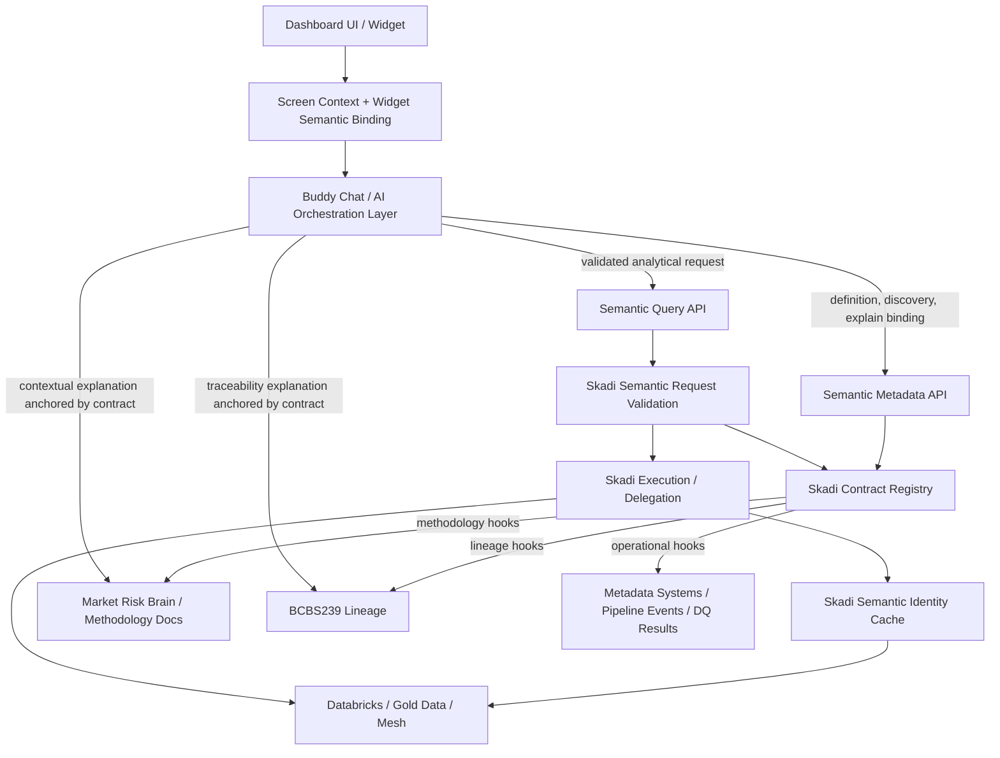

# ADR-008: Milestone Decision — Buddy Chat Interrogates Semantic Model for Query Execution and Semantic Explanation

**Status:** Accepted
**Date:** 2026-05-16
**Owners:** engineering, architecture
**Related ADRs:** ADR-004, ADR-005, ADR-006, ADR-007
**Supersedes:** —

---

## 1. Context

### Problem

Skadi is evolving from a SQL/query acceleration and caching layer into a governed semantic
execution and dashboard platform. The dashboard architecture includes a buddy chat / AI assistant
embedded in the UI. This assistant must help users understand what they are seeing, ask follow-up
questions, and safely request new views of governed data.

The buddy chat must not become an independent or unofficial source of business meaning. It must
not answer business-definition questions from prompt memory, hardcoded rules, disconnected
chatbot-specific knowledge, or generic LLM knowledge when the question is specific to an active
Skadi semantic model.

### Background

- ADR-004 defines the semantic query layer as the governed interface for analytical requests.
- ADR-005 defines semantic contracts as the governed unit of semantic meaning, query shape, and
  execution constraints.
- ADR-006 defines dashboard bricks as governed UI components bound to semantic contracts.
- ADR-007 defines AI chat integration points and prevents AI chat from generating raw SQL or
  bypassing the semantic layer.

This ADR extends those decisions with a milestone principle: the buddy chat must interrogate the
semantic model not only for query execution, but also for semantic explanation, discovery,
validation, and user guidance.

---

## 2. Decision

The buddy chat must be able to interrogate the governed semantic model for both:

1. **Semantic query execution** — converting a user request into an approved semantic request that
   is validated and executed through Skadi / the semantic execution layer.
2. **Semantic explanation / metadata interrogation** — answering questions about definitions,
   grain, filters, dimensions, measures, lineage hooks, entitlement behavior, output shapes, and
   dashboard bindings using governed semantic metadata.

The semantic model is the source of truth for structured business meaning. The buddy chat is the
conversational interface to that meaning.

> The buddy chat may summarize and contextualize semantic definitions, but must not maintain
> independent business definitions outside the governed semantic model.

### 2.1 Query execution examples

Examples of user requests that must route through semantic request validation and execution:

- "Show me VaR by Legal Entity."
- "Break this down by Risk Class."
- "Compare today versus yesterday."
- "Filter this to CIB."
- "Can I group this by desk?"

The buddy chat must select and call approved semantic contracts, validate requested measures,
dimensions, filters, grain, output shape, and entitlement scope, and let Skadi or the semantic
execution layer resolve the request safely.

The buddy chat must not generate arbitrary SQL against raw tables for governed analytical
questions.

### 2.2 Semantic explanation examples

Examples of user requests that must route through semantic metadata interrogation:

- "What is VaR?"
- "What VaR measure is this chart showing?"
- "What does Legal Entity mean here?"
- "What grain is this data?"
- "What filters are currently applied?"
- "Where does this number come from?"
- "Why can't I drill into desk-level detail?"

For example, "What is VaR?" must be answered using the active VaR measure definition from the
semantic model, plus dashboard context when the user is viewing a specific chart or widget. It
must not be answered as a generic LLM-only finance explanation when a governed semantic definition
exists.

### 2.3 Semantic contract metadata requirements

Semantic contracts are not only query definitions. They must carry enough business-facing metadata
to support explanation, discovery, validation, and guided exploration.

Semantic contracts must expose explainable metadata for:

- measures
- dimensions
- grains
- valid filters
- valid grouping paths
- entitlement behavior
- lineage hooks
- output shapes
- contract version
- ownership
- intended usage
- common business caveats or ambiguities

### 2.4 Screen-context awareness

The buddy chat must be screen-context aware. When a user asks "What is this chart showing?", the
assistant must know:

- which widget is active
- which semantic contract powers it
- which measures and dimensions are bound
- which filters are applied
- which contract version is active
- which entitlement scope applies to the user

This screen context is provided by the dashboard / UI runtime and presentation metadata layer. The
buddy chat uses it to identify the relevant semantic binding before interrogating metadata APIs or
executing semantic requests.

### 2.5 Entitlement awareness

The buddy chat must be entitlement-aware. It must not suggest drilldowns, dimensions, measures, or
data scopes that the user is not permitted to access.

If a drilldown, grouping path, measure, or data scope exists but is restricted, the assistant should
explain that access is limited by entitlement policy. The explanation must not leak restricted
values or restricted business details beyond what the user is allowed to know.

### 2.6 Semantic discovery

The buddy chat must support semantic discovery by interrogating contract metadata. Users should be
able to ask:

- "What can I group this by?"
- "What filters are available?"
- "What related measures exist?"
- "Can I compare this over time?"
- "Is there a drilldown contract?"
- "What output shapes are available?"

Discovery responses must be scoped to the user's entitlement, dashboard context, and active
semantic contract version.

### 2.7 Required API direction

Skadi should expose semantic metadata APIs and semantic query APIs. Initial APIs should include, or
leave explicit extension points for:

- list contracts
- get contract details
- list measures
- get measure definition
- list dimensions
- get dimension definition
- explain contract
- explain widget binding
- validate semantic request
- execute semantic request

### 2.8 Lineage and document knowledge hooks

The semantic contract is the semantic anchor for explanation. Deeper explanations may require
external supporting sources, including:

- Market Risk Brain / methodology documents
- BCBS239 lineage database
- Databricks metadata
- pipeline event logs
- data-quality results

These systems should be integrated through explicit hooks from the semantic contract, not through
unbounded chatbot memory or disconnected AI-specific knowledge stores.

---

## 3. Core Principle

The semantic model is the source of truth for structured business meaning. The buddy chat is the
conversational interface to that meaning.

This principle prevents AI meaning sprawl: the uncontrolled emergence of separate business
definitions in prompts, chatbot tools, hardcoded rules, local documentation snippets, or raw SQL
examples that drift away from governed semantic contracts.

---

## 4. Architecture Direction

The target interaction pattern is:

Skadi responsibilities:

- load and expose semantic contracts
- expose semantic metadata APIs
- validate semantic requests
- resolve approved requests to executable plans
- execute or delegate execution
- cache results by semantic identity
- preserve auditability for both dashboard-driven and chat-driven requests

Buddy chat responsibilities:

- interpret the user's natural language question
- retrieve screen context and widget semantic binding
- interrogate semantic metadata before answering model-specific questions
- validate possible requests before execution
- call semantic query execution when needed
- summarize and contextualize governed definitions and results

---

## 5. Consequences

### Positive

- **Dashboard explainability:** Users can ask what a chart means, what measure is being shown,
  what filters are applied, and what grain is active.
- **Governed AI:** The assistant speaks through governed semantic contracts instead of inventing
  or memorizing business definitions.
- **Entitlement safety:** The assistant only discovers, explains, suggests, and executes within the
  user's allowed semantic scope.
- **Avoidance of AI meaning sprawl:** Business definitions stay in the semantic model rather than
  fragmenting into chatbot prompts, hardcoded rules, or unmanaged documents.
- **Stronger semantic contract design:** Contracts must become explanatory and discoverable, not
  merely executable.
- **Cache and execution consistency:** Chat-driven queries and widget-driven queries can share
  semantic identity, execution planning, audit, and cache behavior.

### Negative / Risks

- Semantic contracts become richer and require stronger governance discipline.
- The metadata API surface becomes part of the platform contract and must remain stable.
- Screen-context handoff between UI runtime and buddy chat becomes architecturally important.
- Entitlement filtering must apply to metadata discovery, not only to executed data.
- Lineage and methodology answers may be incomplete until external systems are integrated.

### Operational Impact

- Contract loading must preserve explanation metadata, not only execution metadata.
- The Contract Registry must support metadata lookup and request validation.
- Audit events should distinguish dashboard widget execution from buddy chat execution while
  preserving the same semantic identity model.
- Caching should be based on validated semantic identity, not natural-language prompt text.
- Documentation and contract review processes must validate definitions, caveats, ownership,
  and intended usage.

---

## 6. Implementation Guidance

### Phase 1: Metadata Q&A

- Add or formalize semantic metadata endpoints for contracts, measures, dimensions, filters,
  grains, and widget bindings.
- Allow the buddy chat to answer definition and dashboard-context questions using governed
  semantic metadata.
- Support questions such as "What is this chart showing?", "What does Legal Entity mean here?",
  and "What filters are applied?"

### Phase 2: Contract validation

- Add semantic request validation for measure, dimension, filter, grain, output shape, and
  entitlement compatibility.
- Allow the buddy chat to answer "Can I group this by desk?" or "Can I compare this over time?"
  by validating possible requests before execution.
- Return structured validation outcomes: allowed, denied by entitlement, invalid by contract,
  unsupported grain, unsupported output shape, ambiguous request, or requires clarification.

### Phase 3: Governed query execution

- Route approved chat-generated analytical requests through the same semantic query execution path
  used by dashboard widgets.
- Cache results by semantic identity.
- Preserve auditability with source information such as `source=buddy_chat` while sharing core
  query, validation, and execution infrastructure.

### Phase 4: Lineage and methodology explanation

- Use semantic contract hooks to call Market Risk Brain, BCBS239 lineage, Databricks metadata,
  pipeline event logs, and data-quality results.
- Keep the semantic contract as the anchor for external explanation.
- Provide deeper answers to questions such as "Where does this number come from?" and "Why did
  this value change?" without allowing the chat layer to invent lineage or methodology.

---

## 7. Example Routing

| User question | Primary route | Expected behavior |
|---|---|---|
| "What is VaR?" | Semantic Metadata API -> get measure definition | Answer from active governed VaR definition; optionally include caveats and methodology hooks. |
| "What VaR measure is this chart showing?" | Screen context -> explain widget binding -> measure definition | Identify active widget, contract, measure, version, grain, filters, and caveats. |
| "Show me VaR by Legal Entity." | Validate semantic request -> execute semantic request | Validate measure/dimension compatibility and entitlement, then execute through governed path. |
| "Can I group this by desk?" | Validate semantic request / discovery | Return whether desk is an allowed grouping path for this contract and user. |
| "Why can't I drill into desk-level detail?" | Explain widget binding -> entitlement behavior / contract rules | Explain whether blocked by entitlement, unsupported grain, missing drilldown contract, or dashboard design. |
| "Where does this number come from?" | Widget binding -> contract lineage hooks -> lineage/metadata systems | Explain contract source, pipeline/data-quality context, and lineage hooks when available. |
| "What filters are currently applied?" | Screen context -> explain widget binding | List active dashboard, widget, inherited, and user-applied filters. |
| "Compare today versus yesterday." | Validate temporal filter support -> execute semantic request | Validate time dimension and comparison support, then execute or explain unsupported comparison. |

---

## 8. Non-Goals

- The buddy chat is not the semantic layer.
- The buddy chat is not the owner of business definitions.
- The buddy chat does not independently define VaR, ES, Legal Entity, LOB, Risk Class, or other
  business concepts.
- The buddy chat does not bypass semantic contracts to query raw governed tables directly.
- This decision does not require building a full ontology engine immediately.
- This decision does not require all lineage/document integrations to be complete in the first
  implementation phase.
- This decision does not require runtime code changes as part of the milestone capture itself.

---

## 9. Risks and Mitigations

| Risk | Mitigation |
|---|---|
| AI meaning sprawl | Require model-specific business-definition answers to call semantic metadata APIs; prohibit independent business definitions in buddy chat prompts or code. |
| Stale semantic definitions | Include contract version, owner, status, and effective dating in metadata responses; surface active version in explanations. |
| Entitlement leakage | Apply entitlement filtering to metadata discovery and validation, not only query execution; return safe denial explanations. |
| Raw SQL bypass | Keep buddy chat integrated through semantic metadata and query APIs only; no direct Databricks or raw table SQL generation path. |
| Overloading Skadi with chatbot concerns | Keep the buddy chat as an orchestration layer; Skadi owns contracts, validation, execution, cache, and metadata APIs, not conversation memory or UX. |
| Incomplete lineage integration | Use explicit lineage hooks and phased rollout; answer with bounded confidence when lineage systems are not yet integrated. |
| Ambiguous user terms | Use semantic discovery and clarification rather than guessing; present valid measures/dimensions from accessible contracts. |
| Contract metadata quality drift | Add contract review criteria for definitions, caveats, intended usage, and ownership; add future contract linting. |

---

## 10. Alternatives Considered

| Option | Why Rejected |
|---|---|
| Let buddy chat answer business definitions from generic LLM knowledge | Produces inconsistent, unaudited, and potentially stale definitions that may conflict with governed reporting semantics. |
| Store chatbot-specific definitions in prompts or local tool metadata | Creates a second semantic model and guarantees drift from governed contracts. |
| Allow buddy chat to generate SQL directly against Databricks | Bypasses semantic governance, entitlement rules, metric definitions, cache identity, and audit discipline. |
| Treat semantic contracts as execution-only objects | Prevents explainability, discovery, guided exploration, and safe dashboard-aware chat. |
| Build a full ontology engine immediately | Too much scope for the current phase; contracts can expose practical metadata and hooks first. |

---

## 11. Fitness Functions / Enforcement

Initial enforcement is review-oriented until the relevant runtime APIs exist.

Future enforcement should include:

- Contract schema validation requiring measure/dimension descriptions, grain, ownership,
  version, usage, entitlement behavior, and output shape metadata.
- Contract registry tests proving metadata lookup and request validation behave consistently.
- Buddy chat integration tests proving model-specific definition questions call semantic metadata
  before response generation.
- Negative tests proving buddy chat cannot call raw SQL execution for governed analytical
  questions.
- Entitlement tests proving restricted dimensions/measures are filtered from discovery responses.
- Audit tests proving chat-driven execution records semantic identity, contract version, principal,
  and source.

Until those checks exist:

> No automated enforcement for this ADR beyond architecture review and documentation review.

---

## 12. Open Questions

- What is the exact contract schema shape for explanation metadata, caveats, ownership, and usage?
- Should semantic metadata APIs live under `skadi-semantic`, `skadi-server`, or a separate module?
- How should screen context be serialized from the dashboard runtime into the buddy chat request?
- What is the safe denial language for entitlement-restricted metadata discovery?
- How should contract version and effective dating be represented in user-facing explanations?
- What is the first minimal lineage hook interface for Market Risk Brain and BCBS239 lineage?
- How should semantic identity be normalized for cache keys when a request originates from chat?
- Should methodology document excerpts be cited directly in buddy chat responses, or summarized
  with source pointers?

---

## 13. References / Related Decisions

- [ADR-004: Semantic Query Layer (`skadi-semantic`)](ADR-004-semantic-query-layer.md)
- [ADR-005: Semantic Contracts (YAML format and governance)](ADR-005-semantic-contracts.md)
- [ADR-006: Dashboard Brick Model (composable, governed dashboards)](ADR-006-dashboard-brick-model.md)
- [ADR-007: AI Chat Integration Points (semantic-layer-only access)](ADR-007-ai-chat-integration.md)
