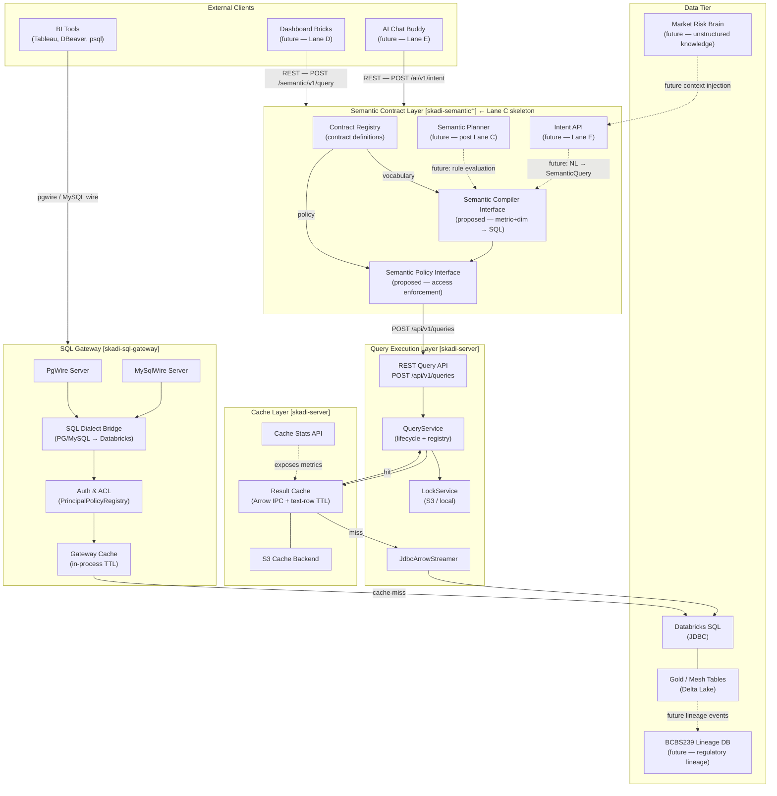

# Skadi Platform Boundary Model

**Status:** Accepted  
**Issue:** skadi#39 (Lane C: C1)  
**Date:** 2026-05-14  
**Lane:** C — Contracts, Skeletons, and Architectural Boundaries

---

## Purpose

This document defines the responsibilities and non-responsibilities of every major Skadi
platform component **before** implementation expands beyond the SQL Gateway. It is the
authoritative reference for Lane C boundary decisions and the guardrail against scope creep
through C2–C8.

Lane C is about **contracts and skeletons, not full semantic implementation**. No semantic
planner, UI runtime, AI chatbot, or entitlement engine is built in Lane C. Those systems
are shown here only as future consumers of the contracts that Lane C will define.

**C1 (this document) is documentation-only.** No Java code is added in C1. Later Lane C
stories (C2–C7) may introduce isolated Java records, interfaces, no-op stubs, and offline
tests inside a candidate `skadi-semantic` module. No production code in `skadi-sql-gateway`
or `skadi-server` is changed at any point in Lane C.

---

## Architecture Diagram

> **Dashed arrows** represent future integration seams that are **not implemented in Lane C**.  
> **Solid arrows** represent existing (Lanes A/B) or Lane C skeleton paths.  
> **†** `skadi-semantic` is a candidate module name — not yet a Maven module; confirmed in C2.  
> Endpoint paths prefixed `POST /semantic/…` and `POST /ai/…` are proposed names, not yet implemented.

---

## Component Owns / Does-Not-Own Table

### SQL Gateway (`skadi-sql-gateway`)

| Owns | Does NOT Own |
| --- | --- |
| PostgreSQL and MySQL wire-protocol sessions | Semantic metric or dimension definitions |
| Per-session auth and schema-level ACL (`PrincipalPolicyRegistry`) | Governed query compilation |
| SQL dialect translation (PG/MySQL → Databricks SQL) | Result cache ownership or eviction |
| In-process TTL cache for raw SQL results | Business metric definitions or dataset versioning |
| Direct JDBC connection pool to Databricks | Audit trail for semantic access denials |
| `information_schema` / `pg_catalog` metadata facade | Any awareness of semantic contracts |
| Protocol completeness for Tableau, DBeaver, psql, JDBC clients | UI rendering or dashboard assembly |

**Lane C boundary:** The gateway is complete as of Lane B. Lane C adds no new gateway concerns.
The gateway must not be extended to interpret semantic contracts — that seam belongs in the
candidate `skadi-semantic` module.

**Lane B reality — direct Databricks path:** The gateway connects to Databricks directly via
JDBC, bypassing `skadi-server` entirely. This produces the dual-path topology shown in the
diagram (gateway → Databricks direct; semantic layer → `skadi-server` → Databricks) and is
the known architectural gap recorded as debt item L10. Whether the gateway should eventually
route through `skadi-server` to deduplicate the JDBC pool is an open design question — see
ADR-004 Open Question Q3 and DQR-002. No convergence work happens in Lane C.

---

### Query Execution Layer (`skadi-server`)

| Owns | Does NOT Own |
| --- | --- |
| `POST /api/v1/queries` REST endpoint | Wire-protocol session handling |
| Query lifecycle (registry, lock coordination, result streaming) | Semantic contract loading or validation |
| `JdbcArrowStreamer` — JDBC → Arrow IPC row streaming | Metric or dimension compilation |
| Distributed lock coordination (`S3LockService`, `LocalLockService`) | Governance policy enforcement |
| Named query registry (`QueryRegistry`) | Intent resolution or LLM calls |
| Health and peer endpoints | Dashboard brick registry |

**Lane C boundary:** `skadi-server` is the execution backend that `skadi-semantic` will call via
`POST /api/v1/queries`. In Lane C this call is stubbed — real activation is story C5. The
execution layer must not grow semantic awareness; it is a pure execute-and-cache engine.

---

### Cache Layer (`skadi-server` cache subsystem)

| Owns | Does NOT Own |
| --- | --- |
| TTL-keyed result cache (Arrow IPC + text-row formats) | Cache key generation outside of `skadi-server` |
| S3 backend for distributed cache writes | Semantic-level cache policy (TTL overrides from contracts) |
| Cache metrics exposed to Micrometer/Prometheus | Dataset version awareness (gap L3 — deferred to C4 or post-Lane C) |
| Cache eviction and entry management | Per-brick or per-user cache segments |

**Positioning:** The cache sits between Databricks and all higher-level consumers —
whether they arrive via raw SQL (gateway direct) or semantic query (semantic layer → execution
layer). Both paths benefit from the same cache. The cache does not know whether a query
originated from Tableau or from an AI chat session.

**Lane C boundary:** Story C4 defines the cache contract interface (how `skadi-semantic` will
express cache hints from contract TTL config). No cache rewrite happens in Lane C — only
interface definition.

---

### Semantic Contract Layer (`skadi-semantic`)

| Owns | Does NOT Own |
| --- | --- |
| Contract definitions in a storage format tracked by DQR-001 (ADR-005 proposes YAML) | Wire-protocol sessions |
| `ContractRegistry` interface — loading, validating, and exposing contracts | Direct JDBC access to Databricks |
| Semantic compiler interface — metric + dimension selections → Databricks SQL | Result caching (delegated to `skadi-server`) |
| Governance/policy interface — principal access to dataset/metric/dimension | Physical table names in client-facing error messages |
| `POST /semantic/v1/query` REST API (proposed endpoint path) | Query execution (delegated to `skadi-server`) |
| Audit log events for semantic access denials | UI rendering or dashboard layout |
| Contract versioning (strategy tracks DQR-001) | LLM calls or intent resolution (future Lane E) |

**Lane C boundary (what is built in C2–C5):** Java records and interfaces for
`SemanticContract`, `ContractRegistry`, `SemanticQuery`, `SemanticCompiler`,
`SemanticPolicyEnforcer`, and `SemanticExecutor`. All implementations are no-op stubs
returning fixture data. The `POST /semantic/v1/query` endpoint shape is defined but backed
by a stub. No live call to `skadi-server` in Lane C. Contract storage format (YAML, JSON, or
other) is tracked by DQR-001 — see ADR-005 (status: Proposed) for the leading candidate.

**What is NOT built in Lane C:** The semantic planner, entitlement engine beyond basic role
checks, intent resolution, response generation, or any LLM integration.

---

### Semantic Planner / Rule Engine (future — post Lane C)

| Owns (future) | Does NOT Own |
| --- | --- |
| Multi-step query plan generation from semantic intent | Wire-protocol details |
| Rule evaluation over contract metadata | Execution — delegated to semantic compiler + execution layer |
| Query optimization hints derived from contract metadata | Direct Databricks access |

**Extension seam:** The `SemanticCompiler` interface defined in Lane C includes a
`compile(SemanticQuery, PlanHints)` signature. A planner that produces `PlanHints` plugs in
at this seam without changing the compiler or execution path. Lane C defines the seam;
the planner is never instantiated in Lane C.

---

### UI Brick Runtime (future — Lane D)

| Owns (future) | Does NOT Own |
| --- | --- |
| React component library (`skadi-ui-bricks`) rendering bricks | Semantic query compilation |
| Brick and dashboard YAML registry (`GET /bricks/{id}`) | Auth enforcement (delegated to semantic layer) |
| Browser-side cache for rendered results within TTL | Data access or JDBC |
| Dashboard layout and composition | Metric definitions (those live in contracts) |

**Extension seam:** The `POST /semantic/v1/query` endpoint defined in Lane C is the only
interface the brick runtime will call. The brick runtime never calls the gateway or Databricks
directly. Lane C defines and stubs this endpoint; the brick runtime is never instantiated in
Lane C.

---

### AI Chat Buddy (future — Lane E)

| Owns (future) | Does NOT Own |
| --- | --- |
| Natural language → `SemanticQuery` intent resolution | Raw SQL generation |
| LLM provider abstraction (`LlmProvider`) | Direct Databricks access |
| `POST /ai/v1/intent` and `POST /ai/v1/explain` endpoints | Governance enforcement (delegated to semantic layer) |
| Prompt caching on contract context window | Cache ownership |
| Conversation history management (if multi-turn) | Any capability outside the semantic contract catalog |

**Extension seam:** The `ContractRegistry` defined in Lane C is the vocabulary source for
the LLM context window. The intent resolver reads accessible contracts for a principal and
formats them as a system prompt. Lane C defines this interface; no LLM calls are made in
Lane C.

---

### Databricks / Mesh / Gold Data

| Owns | Does NOT Own |
| --- | --- |
| Physical table storage (Delta Lake, Unity Catalog) | Semantic metric definitions (those live in contracts) |
| SQL execution against warehouse | Protocol translation |
| Delta snapshot versioning (future dataset-version cache keys) | Cache management |
| Unity Catalog access control (orthogonal to Skadi ACL) | Query compilation |

**Positioning:** Databricks is a black-box executor from Skadi's perspective. The gateway
connects via JDBC directly; `skadi-server` connects via JDBC through `JdbcArrowStreamer`.
Neither path knows about Delta snapshots today (gap L3 — dataset version absent from cache
keys). A future extension seam in the cache contract (C4) accommodates dataset-version-keyed
invalidation.

---

### Market Risk Brain (future integration)

| Owns (future) | Does NOT Own |
| --- | --- |
| Unstructured risk knowledge base (models, stress scenarios, expert rules) | Governed data access — delegated to semantic layer |
| Context injection for AI Chat Buddy sessions | Metric definitions (those stay in contracts) |
| Model risk documentation and validation evidence | Any Skadi internal state |

**Extension seam:** Market Risk Brain context is injected into the LLM system prompt by the
intent resolver (`POST /ai/v1/intent`) via a `ContextProvider` interface. This interface is
defined in the intent API (Lane E); Lane C does not need to accommodate it. The seam is
noted here as a reminder that the chat endpoint must not be designed to assume a closed
vocabulary.

---

### BCBS239 Lineage Database (future integration)

| Owns (future) | Does NOT Own |
| --- | --- |
| Regulatory data lineage records (source → transformation → report) | Query execution or caching |
| Lineage event consumption from Skadi audit log | Semantic metric definitions |
| Report-to-data-source mapping for BCBS239 reporting | Access control |

**Extension seam:** The Skadi audit log (`AuditLog`) already records query events with
`query_id`, `principal`, dataset name, and timestamp. BCBS239 lineage integration consumes
these events as an external subscriber — no change to the audit log schema is required in
Lane C. The `source` field (`direct` | `brick` | `ai_chat`) distinguishes query origins for
lineage attribution. Lane C does not build the lineage subscriber; it preserves the audit
event schema as the integration point.

---

## Future Extension Seams Summary

| Seam | Defined In | Consumed By | Lane |
| --- | --- | --- | --- |
| `SemanticCompiler` interface | C2–C3 | Semantic Planner | post-C |
| `POST /semantic/v1/query` endpoint | C5 | UI Brick Runtime | D |
| `ContractRegistry.forPrincipal(principal)` | C2 | AI Intent Resolver | E |
| `POST /ai/v1/intent` + `POST /ai/v1/explain` | E1–E2 | Chat Buddy, Market Risk Brain | E |
| `ContextProvider` interface on intent API | E1 | Market Risk Brain | E+ |
| Audit log `source` field + dataset name | A8 / C5 | BCBS239 Lineage DB | external |
| Cache contract `strategy: dataset-version` | C4 (interface) | Delta snapshot invalidation | post-C |

---

## Implementation Guardrails for C2–C8

These constraints apply to every Lane C story. They are not suggestions — violating them
redefines scope and blocks Lane D/E.

### C2 — Semantic contract skeletons

- Define the `SemanticContract` Java record (dataset, metrics, dimensions, access policy,
  cache config). This is a data structure, not a service.
- Define the `ContractRegistry` interface: `register(SemanticContract)`,
  `forPrincipal(Principal): List<SemanticContract>`, `findByName(String)`.
- Do **not** implement contract file loading from any storage format — the format is tracked
  by DQR-001; C2 defines the Java type only.
- Do **not** implement startup validation or Spring beans — records and interfaces only.

### C3 — Query contract and output-shape metadata

- Define `SemanticQuery` record (dataset name, metric names, dimension names, filters).
- Define `OutputShape` record (column names, types, row count hint).
- Define `SemanticCompiler` interface: `compile(SemanticQuery): String` (returns Databricks SQL).
- Stub implementation returns a fixture SQL string. No real compilation in C3.
- Do **not** wire to `SqlDialectBridge` in C3 — that is a later story.

### C4 — Cache contract boundary

- Define `CacheContract` record (TTL, strategy enum: `TTL` | `DATASET_VERSION`,
  invalidation hints).
- Define `CacheIdentity` record (normalized SQL, principal, dataset version token if
  strategy is `DATASET_VERSION`).
- Do **not** change `skadi-server` cache internals — only define the interface that
  `skadi-semantic` will use when it eventually delegates to `skadi-server`.
- Do **not** implement dataset version resolution — mark it `// future: C4+` and leave a
  comment pointing to gap L3.

### C5 — Service interfaces for semantic-aware execution

- Define `SemanticExecutor` interface: `execute(SemanticQuery, Principal): ArrowResult`.
- `StubSemanticExecutor` returns fixture Arrow data from a test resource file.
- `SkadiserverSemanticExecutor` is a skeleton class with a `TODO: activate HTTP call` comment
  — do **not** implement the actual HTTP call. That activation is tracked in the issue backlog.
- Wire `StubSemanticExecutor` as the active Spring bean behind a `skadi.semantic.executor=stub`
  config flag.
- Do **not** implement the live `POST /api/v1/queries` call in Lane C.

### C6 — ADRs/DQRs for platform boundary decisions

- Write ADRs covering: why Lane C is contracts-only; cache positioning; future lineage seam.
- Write DQRs for open questions that would affect C5+ if answered wrong.
- Do **not** pre-decide questions that are Lane D/E scope.
- Do **not** write ADRs that require code changes not already landed.

### C7 — Contract-focused tests

- Tests must be deterministic and offline — no Databricks, no S3, no Tableau.
- Test `SemanticContract` serialization round-trips (use JSON fixtures; YAML support pending DQR-001).
- Test `ContractRegistry` stub: `forPrincipal` with access granted and denied.
- Test `SemanticQuery` → `OutputShape` structural consistency.
- Test `CacheIdentity` fingerprint uniqueness for distinct inputs.
- Do **not** write integration tests against live services.

### C8 — Dev-status and Lane C runbook

- Update `ai/dev-status.md` with a Lane C tracking table (stories, issues, status, commits).
- Write a Lane C runbook in `ai/lane-c/` covering execution order and agent instructions.
- Do **not** change production Java code.
- Do **not** pre-populate status as complete — mark stories as they actually land.

---

## What Lane C Is and Is Not

| Is | Is Not |
| --- | --- |
| **C1:** documentation defining boundaries, diagrams, and guardrails | A semantic query planner or optimizer |
| **C2–C7:** isolated Java records, interfaces, no-op stubs, and offline tests | A working SQL compiler or dialect translation |
| A `ContractRegistry` interface skeleton (storage format decided in C6) | A contract file loader, YAML parser, or JSON Schema validator |
| Proposed `SemanticCompiler` and `SemanticPolicyEnforcer` interfaces (names confirmed in C2) | A cache rewrite or new eviction strategy |
| A `CacheContract` and `CacheIdentity` interface boundary | A live call to `skadi-server` or Databricks |
| A `SemanticExecutor` stub returning fixture data | An entitlement engine |
| Documentation of future integration seams | A UI runtime or React component |
| ADRs and DQRs capturing boundary decisions (C6) | An AI chatbot or LLM integration |

---

## Relationship to Existing ADRs

| ADR | Relevance to Lane C |
| --- | --- |
| ADR-004: Semantic Query Layer | Proposed `skadi-semantic` module, `SemanticCompiler` interface, `POST /semantic/v1/query` endpoint (all candidate names) — Lane C C2–C5 stub these |
| ADR-005: Semantic Contracts | Status: **Proposed** — YAML + JSON Schema is the leading candidate tracked by DQR-001; `SemanticContract` record and `ContractRegistry` interface are Lane C C2 deliverables regardless of format |
| ADR-006: Dashboard Brick Model | UI Brick Runtime — Lane C only defines the endpoint it will call; runtime is Lane D |
| ADR-007: AI Chat Integration | AI Chat Buddy — Lane C only defines the `ContractRegistry.forPrincipal` interface; `ContextProvider` seam tracked by DQR-003; no LLM code in Lane C |
| ADR-008: Lane C Scope | Authoritative scope boundary for this lane — see `ai/adr/ADR-008-lane-c-scope.md` |
| ADR-009: Contracts Before Planning | Why C2/C3 precede the semantic planner — see `ai/adr/ADR-009-contracts-before-planning.md` |
| ADR-010: Cache Positioning | Cache stays below all consumers; `CacheContract`/`CacheIdentity` from C4 — see `ai/adr/ADR-010-cache-positioning.md` |

---

## Non-Goals for the Entire Lane C

- No semantic planning or query optimization
- No contract loading from any storage backend — C2–C5 define interfaces and stubs only;
  storage format is tracked by DQR-001 (see `ai/dqr/DQR-001-contract-definition-format.md`)
- No live Databricks connection originating from the candidate `skadi-semantic` module
- No UI runtime or React components
- No LLM integration or intent resolution
- No entitlement engine — access control in Lane C is limited to role-name checks on
  stub `SemanticContract` fixtures, not a production enforcement path
- No changes to production Java code in `skadi-sql-gateway` or `skadi-server`
- No convergence of the gateway's direct JDBC path with `skadi-server` (tracked by DQR-002;
  see `ai/dqr/DQR-002-semantic-execution-delegation.md`)
