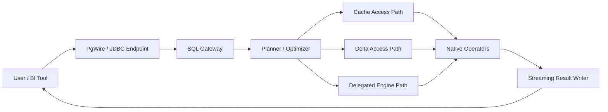
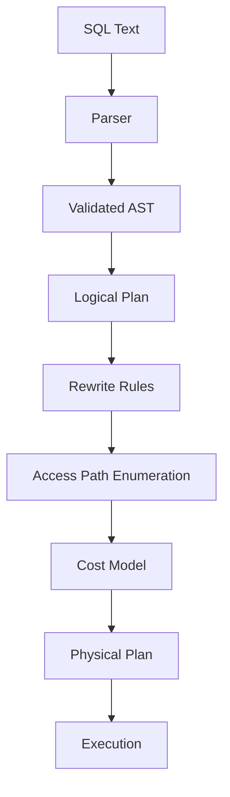
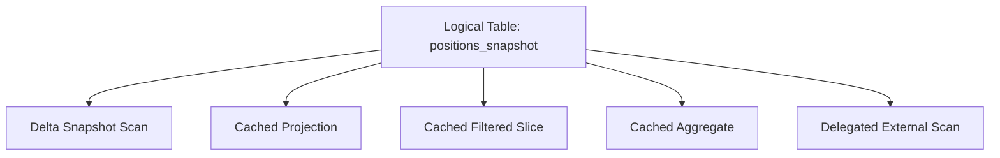
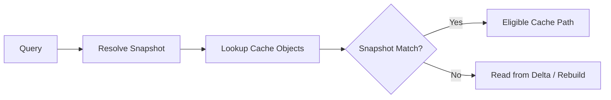
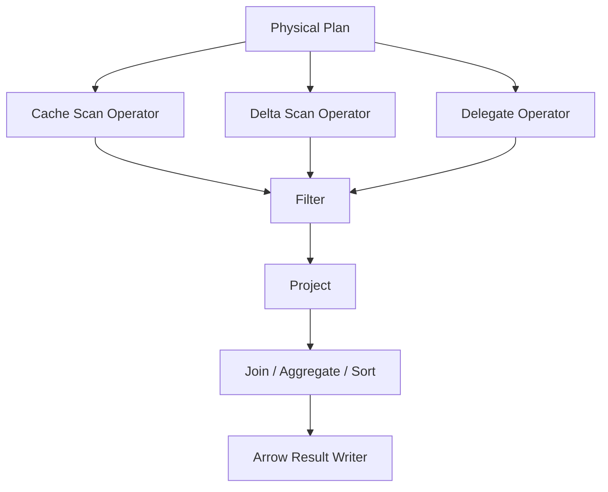
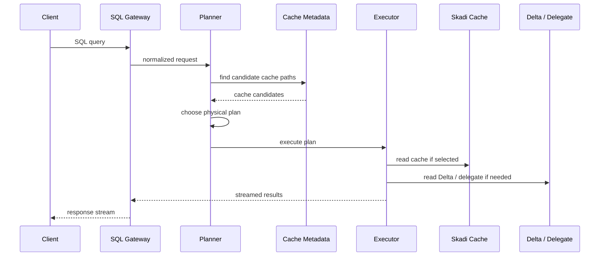

## ⚠️ Status: Future Architecture Option

* **Status:** Proposed (NOT ACTIVE IMPLEMENTATION)
* **Horizon:** Medium → Long Term
* **Part of Current Roadmap:** ❌ No
* **Related Current Work:** Tableau SQL Endpoint (Databricks-backed)

### Dependencies

This direction should only be considered after:

* Stable PgWire/JDBC endpoint
* Proven cache correctness model
* Arrow streaming maturity
* Observability + metrics
* Security & authentication implemented

### Trigger for Adoption

* Need to reduce Databricks compute cost significantly
* High cache hit ratios observed
* Repeated BI workloads dominate usage
* Desire to control execution layer

---

> This document describes a **possible future evolution**, not current behavior.

# Skadi Warehouse Lite — Detailed Architecture

## Architecture Goal

Build a cache-aware SQL platform that can:

- Parse and validate SQL through a Java-centric control plane
- Understand Delta snapshot/version state
- Choose between cache, Delta, or delegated engines
- Execute a useful subset of common BI query patterns natively
- Stream results efficiently through Arrow or row-based responses

## System Context

## Core Layers

### 1. SQL Gateway
Responsibilities:
- Accept PostgreSQL wire protocol traffic
- Support JDBC/ODBC-style client behavior
- Capture session settings and query context
- Normalize SQL into a canonical form

Primary concerns:
- Connection/session lifecycle
- Query parsing entrypoint
- Parameter binding
- Result framing and streaming

### 2. Parser / Validator
Responsibilities:
- Parse SQL into an abstract syntax tree
- Resolve tables, columns, functions, and aliases
- Validate types and expression legality
- Translate dialect subsets into internal logical forms

This layer should isolate SQL compatibility concerns from the execution layer.

### 3. Planner / Optimizer
Responsibilities:
- Build logical plans
- Enumerate alternative physical access paths
- Apply rule-based rewrites
- Estimate relative cost
- Select the best executable plan

The optimizer is where Skadi becomes differentiated: it is not optimizing only for files and operators, but also for **cache reuse** and **snapshot correctness**.

## High-Level Planner Diagram

## Access Path Model

For each logical table reference, the planner should enumerate candidate sources:

- Delta scan for a specific snapshot/version
- Skadi exact result cache
- Skadi projection/predicate fragment cache
- Skadi block or slice cache
- Materialized aggregate/semantic object
- Delegated external engine execution

Example conceptual expansion for `positions_snapshot`:

## Cache Architecture

### Cache Types

#### 1. Result Cache
- Exact SQL + parameter + snapshot match
- Fastest lookup path
- Best for recurring dashboard queries

#### 2. Fragment Cache
- Reusable subquery outputs
- Useful for repeated joins, filters, or projections

#### 3. Table Slice Cache
- Snapshot-aware subsets of tables
- Example: one COB date, one desk, one book hierarchy slice

#### 4. Arrow Block Cache
- Columnar blocks or chunked vector batches
- Suitable for direct streaming into operators

#### 5. Semantic Cache
- Business-level materializations
- Example: "latest positions by desk"

## Cache Metadata Model

Every cache object should be keyed with deterministic correctness fields:

- logical object/table identity
- snapshot or version identifier
- schema hash
- projection signature
- predicate signature
- expression/function semantics version
- cache object format version

## Snapshot Correctness Diagram

## Delta Access Layer

Responsibilities:
- Resolve current or requested snapshot/version
- Enumerate data files for a scan
- Apply metadata-driven pruning
- Map schema and partition metadata into planning structures

This layer should remain separate from the SQL parser and from native operator code.

## Execution Layer

The execution layer should support both native and delegated strategies.

### Native Execution Scope (initially)
- Scan from cache blocks
- Projection
- Filter
- Limit
- Sort/top-N for bounded workloads
- Grouped aggregate for common patterns
- Simple dimension joins where one side is small or cached

### Delegated Execution Scope
- Complex joins
- Unsupported SQL constructs
- Heavy distributed workloads
- Queries where cost model indicates external engine is more efficient

## Execution Architecture

## Result Output Layer

Responsibilities:
- Stream results incrementally
- Support Arrow-first output where feasible
- Fallback to row-oriented framing when needed
- Preserve backpressure and low-memory behavior where possible

## Main Runtime Flow

1. Accept SQL request
2. Normalize SQL and bind parameters
3. Parse and validate
4. Build logical plan
5. Resolve snapshot/version
6. Enumerate candidate access paths
7. Cost candidate plans
8. Execute chosen plan
9. Stream results
10. Populate or refresh cache objects as policy allows

## End-to-End Sequence

## Architecture Principles

### Snapshot First
All planning and caching decisions must preserve snapshot correctness.

### Cache as Physical Source
Cache objects are not an afterthought; they are physical plan alternatives.

### Hybrid by Design
The system should support mixed plans instead of forcing all-or-nothing execution.

### Incremental Capability
The first versions should solve repeated BI/reporting workloads well rather than attempt full SQL generality.

### Clear Separation of Concerns
- SQL semantics
- metadata/snapshot handling
- optimization
- execution
- cache management

should remain modular.

## Architectural Risks

### 1. Dialect Ambition
Trying to clone the full Databricks SQL dialect too early could stall the program.

### 2. Cache Invalidation Complexity
Cache correctness must stay deterministic and explainable.

### 3. Overbuilding the Native Engine
The initial native engine should target high-value workloads, not every possible SQL feature.

## Recommended Near-Term MVP Boundary

Support:
- SELECT-heavy BI queries
- Snapshot-bound reads
- Repeated filters/projections/aggregations
- Exact-result and fragment reuse
- Delegation for unsupported plans

Avoid initially:
- complex DDL
- broad write semantics
- advanced procedural SQL
- full engine parity ambitions
