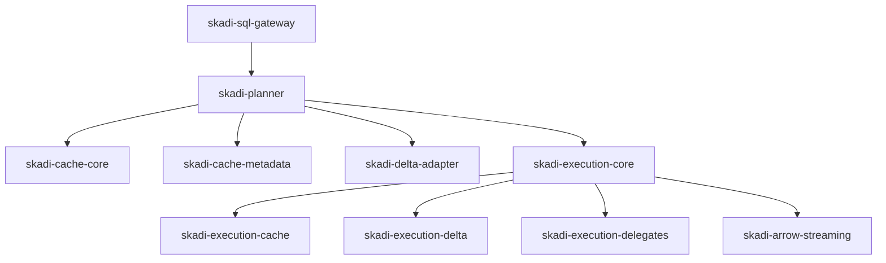
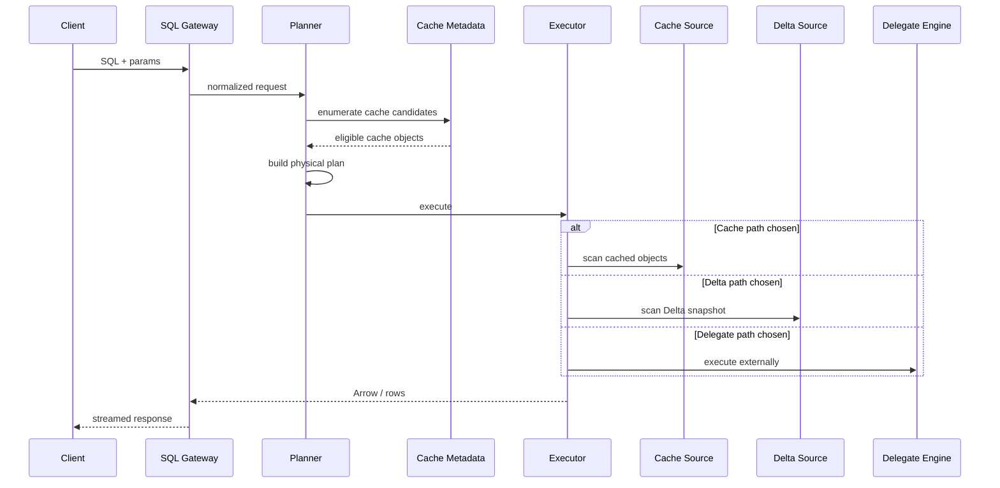
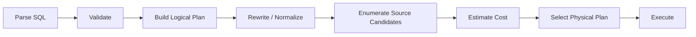
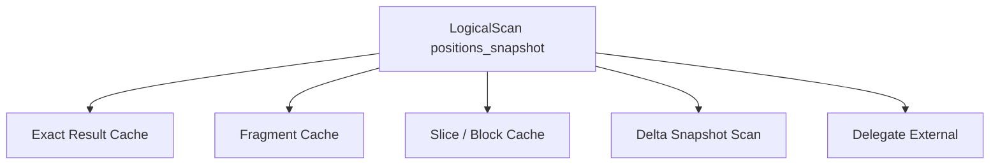
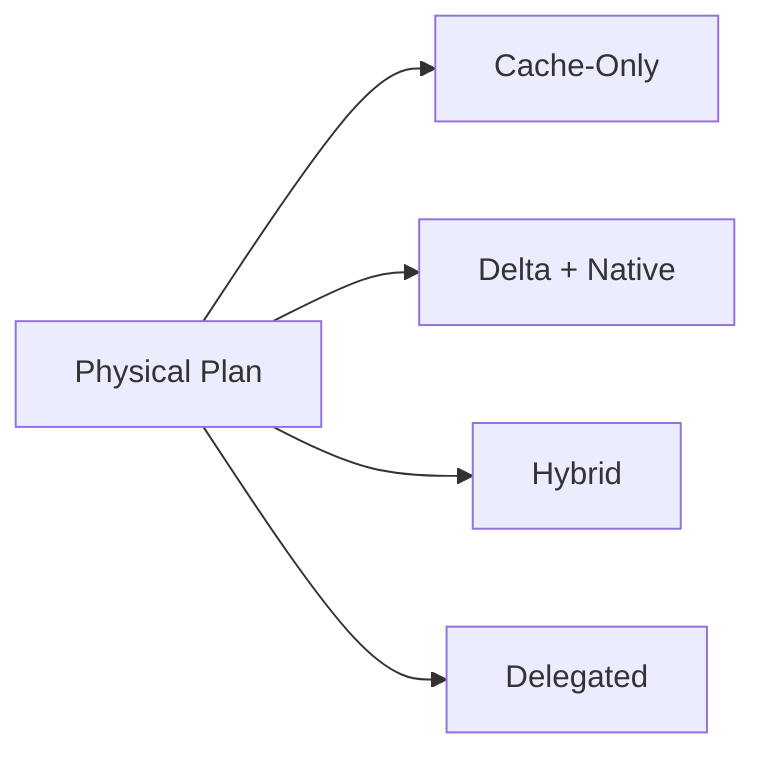
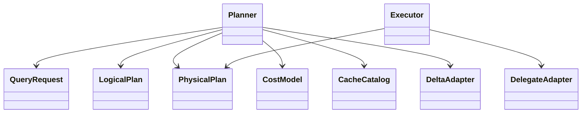

## ⚠️ Status: Future Architecture Option

* **Status:** Proposed (NOT ACTIVE IMPLEMENTATION)
* **Horizon:** Medium → Long Term
* **Part of Current Roadmap:** ❌ No
* **Related Current Work:** Tableau SQL Endpoint (Databricks-backed)

### Dependencies

This direction should only be considered after:

* Stable PgWire/JDBC endpoint
* Proven cache correctness model
* Arrow streaming maturity
* Observability + metrics
* Security & authentication implemented

### Trigger for Adoption

* Need to reduce Databricks compute cost significantly
* High cache hit ratios observed
* Repeated BI workloads dominate usage
* Desire to control execution layer

---

> This document describes a **possible future evolution**, not current behavior.

# Skadi Warehouse Lite — Concrete Design

## Design Objective

Define a practical implementation structure for an incremental evolution of Skadi into a **cache-aware SQL acceleration and execution layer**.

This document focuses on module boundaries, interfaces, plan representation, cache object design, and phased build sequencing.

## Proposed Repository / Module Direction

## Proposed Modules

### skadi-sql-gateway
Responsibilities:
- PgWire endpoint
- session handling
- SQL request admission
- parameter binding
- response streaming integration

### skadi-planner
Responsibilities:
- parser integration
- validation
- logical plan model
- physical planning
- rewrite rules
- cost model

### skadi-cache-core
Responsibilities:
- cache storage abstraction
- cache read/write APIs
- cache object lifecycle
- TTL and eviction policy hooks

### skadi-cache-metadata
Responsibilities:
- cache catalog
- snapshot mappings
- cache object signatures
- cache lookup and eligibility logic

### skadi-delta-adapter
Responsibilities:
- Delta snapshot resolution
- file enumeration
- partition/schema metadata
- scan planning metadata

### skadi-execution-core
Responsibilities:
- operator model
- plan executor
- pipeline orchestration
- result materialization policy

### skadi-execution-cache
Responsibilities:
- read operators for result/fragment/block caches
- block decoding
- cache-native scan behavior

### skadi-execution-delta
Responsibilities:
- Delta scan operators
- scan chunk production
- pushdown integration where available

### skadi-execution-delegates
Responsibilities:
- external engine adapters
- delegated execution contracts
- result stream adaptation

### skadi-arrow-streaming
Responsibilities:
- Arrow batch framing
- row fallback conversion
- client streaming abstractions

## Request Lifecycle

## Core Internal Interfaces

### QueryRequest
Suggested fields:
- `sql`
- `normalizedSql`
- `parameters`
- `sessionContext`
- `requestedSnapshot`
- `timeout`
- `resultFormat`

### LogicalPlan
Represents validated SQL in engine-neutral form.

Suggested node categories:
- `LogicalScan`
- `LogicalProject`
- `LogicalFilter`
- `LogicalJoin`
- `LogicalAggregate`
- `LogicalSort`
- `LogicalLimit`

### PhysicalPlan
Represents executable operators chosen by the optimizer.

Suggested node categories:
- `CacheScanExec`
- `DeltaScanExec`
- `DelegateExec`
- `FilterExec`
- `ProjectExec`
- `HashJoinExec`
- `AggregateExec`
- `SortExec`
- `LimitExec`

### DataSourceCandidate
Represents one possible access path for a logical relation.

Suggested fields:
- `sourceType`
- `snapshotId`
- `estimatedRows`
- `estimatedBytes`
- `predicateCoverage`
- `projectionCoverage`
- `freshnessState`
- `reuseScore`
- `costEstimate`

### CacheObjectDescriptor
Suggested fields:
- `cacheObjectId`
- `cacheType`
- `logicalObjectName`
- `snapshotId`
- `schemaHash`
- `projectionSignature`
- `predicateSignature`
- `encodingType`
- `rowCount`
- `byteSize`
- `createdAt`
- `expiresAt`

## Planning Pipeline

## Optimizer Decision Model

The optimizer should incorporate more than classic file/CPU cost.

### Core Cost Inputs
- estimated bytes to read
- rows to scan
- expected selectivity
- network transfer cost
- CPU complexity
- memory pressure
- cache hit confidence
- cache object decode cost
- snapshot locality / freshness fit
- delegation overhead

### Example Decision Heuristics
- Prefer exact result cache when snapshot and semantics fully match
- Prefer fragment/table-slice cache when projected columns and predicates are mostly covered
- Prefer Delta scan when cache objects are absent or too stale
- Prefer delegation when SQL features are unsupported or distributed execution is clearly cheaper

## Access Path Enumeration

For each logical scan, enumerate candidate sources.

Example:

## Cache Object Strategy

### 1. Exact Result Cache
Use when the normalized query, parameters, snapshot, and semantics version match exactly.

### 2. Fragment Cache
Use for reusable subplans such as:
- filtered fact slices
- projected subsets
- dimension subsets
- prejoined small reference structures

### 3. Block Cache
Use as low-level physical storage for:
- Arrow columnar chunks
- scan-friendly operator input
- hot table slices

### 4. Semantic Materializations
Use for stable business-level patterns such as:
- latest positions by desk
- exposure summaries by regulator
- daily risk aggregate snapshots

## Cache Eligibility Rules

A cache object is usable only if:
- snapshot matches
- schema matches
- semantics version matches
- projection is covered
- predicate coverage is compatible
- object has not expired or been invalidated

## Native Execution Scope

Recommended first native operator set:
- cache scan
- filter
- project
- limit
- bounded sort/top-N
- hash aggregate
- small-dimension hash join

This is enough to support many dashboard and reporting patterns without trying to implement full warehouse semantics immediately.

## Execution Topologies

### Topology A — Cache-Only
Fast path for exact result or reusable fragment workloads.

### Topology B — Delta + Native
Read Delta directly and run lightweight operators natively.

### Topology C — Hybrid
Use cache for one relation and Delta for another in the same plan.

### Topology D — Delegated
Route the full plan to an external engine when needed.

## Suggested Build Phases

### Phase 1 — Control Plane Foundation
Build:
- SQL gateway
- normalized request model
- parser/validator integration
- cache metadata lookup
- full-plan delegation
- result cache population

### Phase 2 — Cache-Native Read Path
Build:
- block/result cache scan operators
- Arrow streaming path
- filter/project/limit native operators

### Phase 3 — Hybrid Planning
Build:
- source candidate enumeration
- cost model
- mixed cache + Delta physical plans
- fragment cache support

### Phase 4 — Advanced Reuse
Build:
- materialized semantic objects
- adaptive warming
- precomputation strategies
- better aggregate and join reuse

## Suggested Package-Level Design

## Non-Goals for MVP

- Full Databricks SQL parity
- General distributed write engine
- Full lakehouse governance plane
- Complex DDL completeness
- Every join/analytic edge case on day one

## ADR Candidates Derived from This Design

1. Adopt PgWire as the primary client protocol
2. Treat cache objects as physical access paths in planning
3. Keep Delta snapshot resolution separate from SQL semantics
4. Support delegated execution for unsupported or high-cost plans
5. Start with SELECT-heavy snapshot workloads as the native engine target
