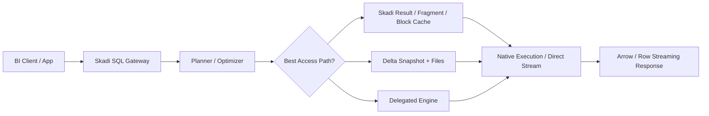
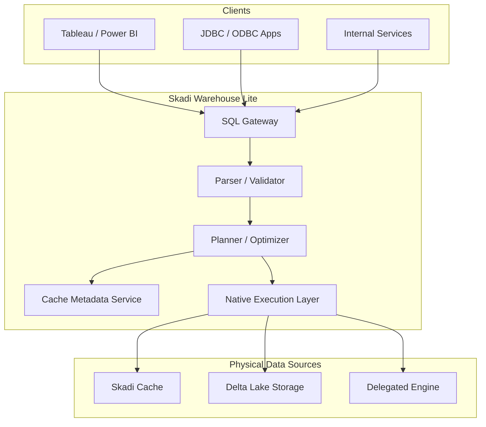

# Skadi Warehouse Lite — Executive Overview

## Vision

Skadi evolves from a caching layer into a **cache-aware SQL warehouse acceleration platform** for Delta Lake and Delta-compatible lakehouse data.

It provides:
- Lower cost than Databricks SQL Warehouse for repeated workloads
- Faster performance for hot BI/reporting paths
- Snapshot-consistent query execution
- Pluggable execution engines
- A Java-centric control plane aligned with the Skadi platform direction

## Core Idea

Instead of always querying Delta directly:

> Queries can be satisfied from **Skadi cache**, **Delta storage**, or **delegated engines**.

The optimizer chooses the cheapest valid path while preserving snapshot correctness.

## Executive Summary

Skadi Warehouse Lite is not intended to be a full clone of Databricks SQL Warehouse on day one.

Instead, it is an **incrementally built warehouse acceleration layer** with three key strengths:

1. **Cache-first execution** for repeated snapshot workloads
2. **Delta-aware planning** so queries remain snapshot correct
3. **Hybrid execution** where Skadi can execute natively, read from cache, or delegate to an external engine

This creates a product with real differentiation rather than just another SQL endpoint.

## Strategic Value

### 1. Cost Reduction
- Avoid repeated scans of large Delta tables
- Reuse exact results, fragments, and table slices
- Reduce expensive warehouse compute for repeated dashboards and BI tools

### 2. Performance
- Arrow-native reads and streaming
- Faster response time for hot query shapes
- Reduced cold-start and cluster overhead compared with heavyweight engines

### 3. Product Moat
- Cache-aware optimizer
- Snapshot-aware cache correctness
- Hybrid execution model
- Reusable platform for Runa / semantic access patterns

### 4. Incremental Adoption
- Can sit in front of existing Delta-backed platforms
- Can initially delegate unsupported queries
- Can evolve gradually into a stronger execution layer

## Positioning Statement

> **Skadi is a Delta-aware, cache-native SQL acceleration layer whose optimizer can execute from cache, from Delta, or via delegated engines, choosing the cheapest snapshot-correct path.**

## What It Is

- A SQL access layer
- A cache-aware query planner
- A hybrid execution platform
- A warehouse acceleration system for repeated analytics workloads

## What It Is Not

- Not a full Spark replacement on day one
- Not just a JDBC proxy
- Not only a result cache
- Not a full Databricks SQL dialect clone in the initial phases

## High-Level Value Flow

## Phased Evolution

### Phase 1 — Smart SQL Router
- Parse and normalize SQL
- Check exact cache hits
- Delegate most execution externally
- Persist reusable results and metadata

### Phase 2 — Native Cached Reads
- Read from Skadi-managed block and fragment caches
- Execute projection, filtering, limit, and simple aggregations natively
- Stream Arrow results directly to clients

### Phase 3 — Cost-Based Hybrid Optimization
- Choose between cache, Delta, and delegation for each plan
- Mix multiple sources inside one physical plan
- Add cost and freshness-aware decision rules

### Phase 4 — Semantic Acceleration
- Add reusable materialized business objects
- Support Runa-style semantic acceleration
- Optimize for recurring BI/reporting patterns

## Executive Architecture Diagram

## Key Benefits for Skadi Evolution

This direction lets Skadi evolve from:
- cache beside the engine

to:
- cache-aware execution substrate

That is a materially stronger product direction because it turns Skadi into part of the query plan itself rather than just a passive storage layer.

## Recommended Decision Framing

Evaluate this option as a **future-direction architecture** with the following design questions:

- How much native SQL execution should Skadi own?
- Which query classes should be cache-first?
- When should queries delegate to another engine?
- Which cache object types provide the best payoff first?
- How much Databricks SQL compatibility is necessary for the MVP?
