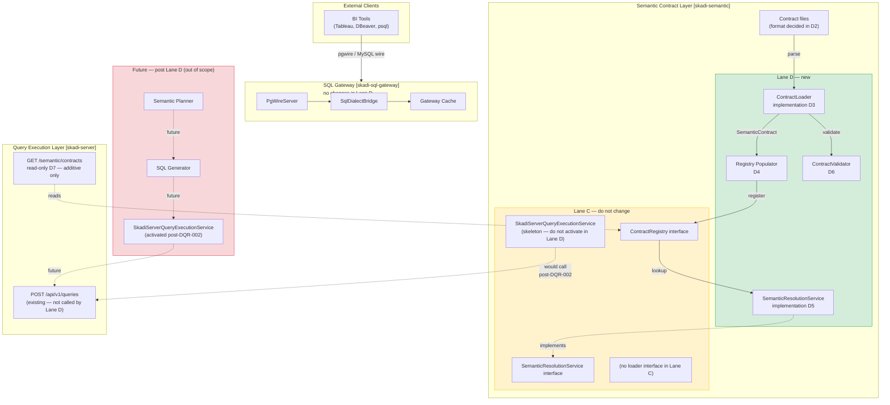

# Lane D — Contract Loading Activation Boundary

**Status:** Accepted
**Issue:** skadi#62 (Lane D: D1)
**Date:** 2026-05-14
**Lane:** D — Contract Loading, Resolution, and Runtime Activation

---

## 1. Purpose

This document defines the exact boundary of what Lane D is allowed to activate from Lane C.

Lane D's job is to make semantic contracts loadable, validateable, and resolvable at runtime.
Lane D does **not** build a semantic query planner, SQL generator, or live execution path.

**D1 (this document) is documentation-only.** No Java code is added in D1.
Later Lane D stories (D2–D8) introduce a contract loader, registry population, a resolution
service, contract validation types, and an optional read-only metadata endpoint. Lane D makes
no behavioral changes to `skadi-sql-gateway` or `skadi-server`.

---

## 2. Relationship to Lane C

Lane C (`skadi-semantic`) delivered:

- Java records defining the semantic contract model (`SemanticContract`, `SemanticEntity`,
  `SemanticMeasure`, `SemanticDimension`, `SemanticAccessPolicy`, `SemanticCachePolicy`)
- The `ContractRegistry` interface (no file-backed implementation)
- Query contract and output-shape types (`SemanticQueryContract`, `SemanticOutputShape`,
  `SemanticOutputColumn`, `SemanticReference`)
- Cache boundary types (`CacheIdentity`, `CacheContract`, `CacheLookupResult`, etc.)
- Service interfaces: `QueryExecutionService`, `QueryMetadataService`,
  `SemanticResolutionService`, `CacheLookupService`, `LineageContextProvider`
- No-op implementations: `NoOpCacheLookupService`, `NoOpLineageContextProvider`
- A skeleton: `SkadiServerQueryExecutionService` (throws `UnsupportedOperationException`)
- JSON test fixtures; ADR-008/009/010; DQR-001/002/003

Lane C deliberately stopped short at three seams:

| Seam | Lane C Stopped At | Lane D Activates |
|---|---|---|
| Contract storage format | DQR-001 left open | D2 resolves and records decision |
| Contract loading from files | No `loadFromDirectory` on `ContractRegistry` | D3 adds `ContractLoader` implementation |
| Contract resolution at runtime | `SemanticResolutionService` interface only | D5 adds working resolver |

Lane C left `SkadiServerQueryExecutionService` as a skeleton. **Lane D does not activate it.**
DQR-002 (execution delegation topology) must be resolved first, and that is explicitly post-D8.

---

## 3. What Lane D Activates

Lane D may introduce code and tests for the following, and nothing more:

| Activation | Deliverable | Story |
|---|---|---|
| Contract file format decision | ADR recording YAML or JSON choice; DQR-001 resolved | D2 |
| Contract loader | `ContractLoader` interface; file-backed implementation reading from classpath or configured path | D3 |
| Registry population | Component that calls `ContractRegistry.register()` for each loaded contract | D4 |
| Contract validation | `ContractValidationResult`, `ContractValidationIssue`; validator implementation | D6 |
| Contract resolution service | `SemanticResolutionService` implementation backed by a populated `ContractRegistry` | D5 |
| Read-only metadata endpoint | Optional: list/get loaded contracts; return validation status; no query execution | D7 |
| Documentation | dev-status, runbook, test-count progression | D8 |

### What is in-scope but bounded

- **D3 loader** reads files, parses records, and returns `SemanticContract` instances.
  It does not call Databricks, S3, or any external system.
- **D4 registry** calls `register()` and handles `DuplicateContractException`.
  It does not enforce access policy — that is a future entitlement lane.
- **D5 resolver** looks up a contract by name and returns `SemanticResolutionResult`.
  It does not generate SQL or evaluate cache policy.
- **D6 validator** checks structural integrity and cross-references within the loaded contract set.
  It does not execute SQL or call external systems.
- **D7 endpoint** is read-only. It lists what is loaded and returns validation status.
  It does not execute queries, generate SQL, or mutate contracts.

---

## 4. What Lane D Does NOT Activate

These items are explicitly out of scope for every D-lane story:

| Out of Scope | Reason | Where It Lives |
|---|---|---|
| Semantic query planner | Requires stable contract corpus; dedicated future lane | post-D |
| SQL generation from contract metadata | Requires planner first | post-D |
| Semantic rule execution engine | No rule language defined yet | post-D |
| Entitlement enforcement engine | Access policy semantics not yet decided | post-D |
| `SkadiServerQueryExecutionService` activation | DQR-002 not yet resolved | post-DQR-002 |
| Cache rewrite or cache policy enforcement | DQR-002 governs cache ownership question | post-DQR-002 |
| Databricks semantic execution path | Depends on executor activation | post-DQR-002 |
| UI runtime or React components | Future lane | post-D |
| AI chatbot or LLM integration | Future lane (Lane E) | Lane E |
| Lineage database integration | DQR-003 open | post-D |
| Behavioral changes to `skadi-sql-gateway` | Gateway is complete; no semantic awareness | never in D |
| Behavioral changes to `skadi-server` query execution | D7 endpoint is additive and read-only only | guarded in D7 |

---

## 5. Component Ownership Table

### SQL Gateway (`skadi-sql-gateway`)

| Owns | Does NOT Own in Lane D |
|---|---|
| All capabilities from Lanes A + B (unchanged) | Semantic contract loading or resolution |
| PostgreSQL and MySQL wire-protocol sessions | Any awareness of `ContractRegistry` |
| SQL dialect translation, auth, cache, metadata facade | Contract validation or diagnostics |

**Lane D guardrail:** zero source-file changes to `skadi-sql-gateway` in any D-lane commit.

---

### Query Execution Layer (`skadi-server`)

| Owns | Does NOT Own / Lane D adds |
|---|---|
| `POST /api/v1/queries` REST endpoint (existing) | Contract loading or validation |
| `QueryService`, `QueryRegistry`, `JdbcArrowStreamer` (existing) | `ContractRegistry` or resolver |
| Named query registry (existing) | Any semantic planner logic |
| **D7 only:** read-only contract metadata endpoint (additive) | Query execution on behalf of semantic contracts |

**Lane D guardrail:** `skadi-server` receives at most one additive read-only controller in D7.
No changes to `QueryService`, `QueryRegistry`, `JdbcArrowStreamer`, or any existing endpoint.

---

### Semantic Contract Layer (`skadi-semantic`)

| Owned by Lane C (do not remove) | Added in Lane D |
|---|---|
| All contract records and interfaces | `ContractLoader` interface + file-backed implementation |
| `ContractRegistry` interface | Registry population component |
| `SemanticResolutionService` interface | `SemanticResolutionService` implementation |
| No-op implementations | `ContractValidationResult`, `ContractValidationIssue`, validator |
| `SkadiServerQueryExecutionService` skeleton | Nothing new — skeleton remains a skeleton in Lane D |
| JSON test fixtures | Contract files in chosen format (D2 decides) |

---

### Semantic Planner / Rule Engine (future — post Lane D)

Not touched in Lane D. The `PlanHints` seam defined in Lane C remains an empty record.

---

### Cache Layer (`skadi-server` cache subsystem)

Not touched in Lane D. `CacheContract` and `CacheIdentity` types from Lane C remain as
interface definitions only. The cache policy in loaded contracts is validated structurally
(D6) but not enforced at runtime in Lane D.

---

## 6. Module Dependency Rules

```
skadi-parent
├── skadi-core          (no changes in Lane D)
├── skadi-server        (additive only: D7 read-only endpoint)
├── skadi-sql-gateway   (no changes in Lane D)
└── skadi-semantic      (primary Lane D delivery target)
```

### Allowed in Lane D

- `skadi-semantic` adds: `ContractLoader`, registry populator, `SemanticResolutionService`
  implementation, `ContractValidator`, validation result types
- `skadi-semantic` may gain a compile-time dependency on a YAML or JSON parser library
  if D2 chooses a file format that requires one (add as `<scope>compile</scope>`)
- `skadi-server` gains at most one new `@RestController` in D7 (read-only contract metadata)
- New test-scope fixtures and tests in both modules

### Prohibited in Lane D

- `skadi-sql-gateway` must not gain any dependency on `skadi-semantic`
- `skadi-semantic` must not gain a dependency on `skadi-sql-gateway`
- `skadi-semantic` must not make JDBC calls, HTTP calls to Databricks, or calls to S3
- `skadi-server` must not call `ContractLoader` or populate `ContractRegistry` at startup
  unless the D7 story explicitly scopes and justifies it
- No `@SpringBootApplication` entry point in `skadi-semantic`
- No removal or replacement of Lane C interfaces or no-op implementations

### Spring bean rules

- D3 loader and D4 registry population: Spring beans are permitted if needed for
  classpath scanning and config binding, but must be gated behind a
  `skadi.semantic.contracts.enabled` property defaulting to `false`
- D5 resolver: may be a Spring bean if D4 is wired; same config gate
- D6 validator: plain Java, no Spring required
- D7 endpoint: Spring `@RestController` in `skadi-server`, read-only

---

## 7. Boundary Diagram



> **Green (Lane D — new):** what Lane D adds.
> **Yellow (Lane C — do not change):** interfaces and types from Lane C; do not alter.
> **Red (out of scope):** never activated in Lane D.
> **Dashed arrows:** future integration paths not implemented in Lane D.

---

## 8. D2–D8 Sequencing Guidance

Execute stories in this order. Each story depends on the one before it.

```
D1 (this doc) → D2 → D3 → D6 → D4 → D5 → D7 → D8
```

| Step | Story | Depends On | Notes |
|---|---|---|---|
| 1 | D1 | — | Documentation only; no code |
| 2 | D2 | D1 | Resolves DQR-001; must be decided before any file-parsing code is written |
| 3 | D3 | D2 | File format must be decided to implement the loader |
| 4 | D6 | D3 | Validation is most useful when there is a loader to validate what it loads |
| 5 | D4 | D3 | Registry population requires a working loader |
| 6 | D5 | D4 | Resolver requires a populated registry |
| 7 | D7 | D5 | Metadata endpoint is only meaningful when resolution works |
| 8 | D8 | all | Documentation and runbook after all stories land |

**D6 (validation) before D4 (population):** validate contracts before registering them —
a populator that silently accepts invalid contracts is a correctness risk.

---

## 9. Risks and Guardrails

### Risk 1 — Activating `SkadiServerQueryExecutionService` prematurely

**Risk:** A D5 or D7 story accidentally wires `SkadiServerQueryExecutionService` to call
`POST /api/v1/queries`, before DQR-002 is resolved.

**Guardrail:** The skeleton class throws `UnsupportedOperationException`. Do not change
that behaviour in Lane D. Any call path that reaches it in a test must assert the throw,
not suppress it. Review `ServiceBoundaryTest.skadiserverSkeleton_throwsUnsupported()`.

---

### Risk 2 — Contract loader calling external systems

**Risk:** D3 adds a contract loader that contacts Databricks or S3 to resolve dataset
references as part of loading.

**Guardrail:** The loader reads files only. It returns `SemanticContract` instances.
It does not validate whether referenced Delta tables exist. That is a future extension.
D3 tests must be offline (no network, no S3).

---

### Risk 3 — D7 endpoint executing queries

**Risk:** The D7 read-only metadata endpoint is extended to accept a contract name and
execute a sample query.

**Guardrail:** D7 is explicitly read-only. It returns loaded contract metadata.
Acceptable response payloads: contract list, contract detail, validation status.
Not acceptable: query results, Arrow data, SQL strings generated from contracts.

---

### Risk 4 — Format decision in D2 invalidating Lane C JSON fixtures

**Risk:** D2 chooses YAML, but the Lane C JSON test fixtures (`sample-contract.json`,
`sample-query-contract.json`, `sample-cache-boundary.json`) are assumed to be YAML.

**Guardrail:** The Lane C JSON fixtures are test fixtures for Java record serialization.
They do not need to match the chosen authoring format. D3 adds YAML (or JSON) contract
files for the loader; it does not replace the Lane C test fixtures.

---

### Risk 5 — Lane D adding Spring beans to `skadi-semantic` without a config gate

**Risk:** D3/D4/D5 register Spring beans that start loading contracts unconditionally at
startup, breaking the principle that `skadi-semantic` is a passive library in Lane C.

**Guardrail:** Any Spring wiring in `skadi-semantic` must be behind
`skadi.semantic.contracts.enabled=false` (default). This allows `skadi-sql-gateway` and
`skadi-server` to depend on `skadi-semantic` as a library without activating contract
loading unless explicitly configured.

---

## 10. Validation Checklist

Run these checks after each D-lane story before committing.

```bash
# 1. No source changes to skadi-sql-gateway
git diff --name-only HEAD | grep skadi-sql-gateway/src/ | (grep -v '^$' && echo "FAIL: gateway src changed" || true)

# 2. No behavioral changes to skadi-server (D7 additive controller is allowed)
#    Check manually: only new files under skadi-server/src/main should exist
git diff --name-only HEAD | grep 'skadi-server/src/main'

# 3. Build and test skadi-semantic
mvn verify -pl skadi-semantic -am

# 4. Full project verify (ensures no regressions in gateway/server)
mvn verify

# 5. No new @SpringBootApplication in skadi-semantic
grep -r '@SpringBootApplication' skadi-semantic/src/main && echo "FAIL" || echo "OK"

# 6. SkadiServerQueryExecutionService still throws UnsupportedOperationException
grep -q 'UnsupportedOperationException' \
  skadi-semantic/src/main/java/org/iceforge/skadi/semantic/service/SkadiServerQueryExecutionService.java \
  && echo "OK" || echo "FAIL: skeleton was modified"

# 7. Whitespace and trailing-newline check
git diff --check
```

All checks must pass before marking any D-lane story complete.

---

## 11. Relationship to Existing ADRs and DQRs

| Document | Status | Lane D Impact |
|---|---|---|
| ADR-004: Semantic Query Layer | Proposed | D5 implements `SemanticResolutionService`; does NOT implement the semantic executor path |
| ADR-005: Semantic Contracts | Proposed | D2 resolves format and should update ADR-005 to Accepted (or supersede it) |
| ADR-008: Lane C Scope | Accepted | Lane D extends the seams Lane C defined; does not reopen C-lane scope |
| ADR-009: Contracts Before Planning | Accepted | D-lane respects this; planner is still future |
| ADR-010: Cache Positioning | Accepted | D-lane does not change cache behavior; validates cache policy in contracts only |
| DQR-001: Contract Format | Open | **Resolved in D2** |
| DQR-002: Execution Delegation | Open | Not resolved in Lane D; skeleton remains as-is |
| DQR-003: Lineage/MRB Seams | Open | Not touched in Lane D |

---

## 12. Agent Instructions for Lane D

These notes are for future Claude Code agents implementing D2–D8.

1. **Read this document first.** It defines what is in scope. If a task asks you to do
   something not listed in section 3, stop and confirm before proceeding.

2. **Never activate `SkadiServerQueryExecutionService`.** The class exists to mark the
   integration point, not to be used. It throws by design. If you find yourself changing
   its body, you are out of scope.

3. **D2 before D3.** Do not write any file-parsing code before D2 records the format
   decision. An ADR written after the code is written is not a decision — it is a rationale.

4. **Offline tests only.** All D3–D6 tests must pass without network access, S3, or
   Databricks. Use classpath resources from `src/test/resources`.

5. **Config gate all Spring beans in `skadi-semantic`.** The module must remain usable as
   a plain library. Default the config gate to `false`. Document the property in
   `application.yml` under a comment block.

6. **D7 is optional.** If the read-only metadata endpoint requires more risk than its
   value justifies, it can be deferred. The D7 issue can be closed as out-of-scope if
   the team agrees. D8 must still run and should note any deferred items.

7. **Git hygiene.** One commit per story, tagged `skadi#<issue>` in the commit message.
   Run `git diff --check` before each commit. Close the GitHub issue after push.
