# Skadi Architecture Diagram

This document provides a high-level architecture view of Skadi using Mermaid diagrams.

It is intended for:
- AI coding agents such as Claude Code
- architects reviewing the system
- developers onboarding to the repository

Skadi is a query acceleration and caching layer in front of Databricks SQL Warehouse.
Its primary value comes from:
- reducing repeated query execution
- caching results in Arrow format
- exposing SQL endpoints compatible with BI tools such as Tableau

---

# 1. High-Level System Overview

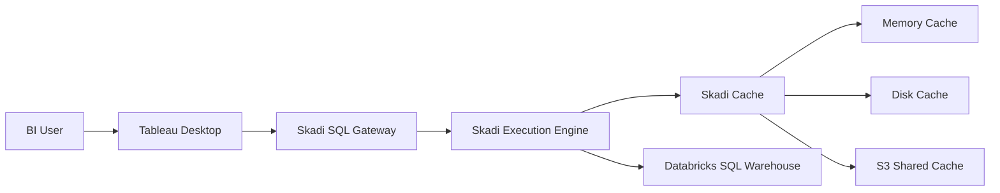
## Notes

Tableau connects to Skadi using a PostgreSQL-compatible wire protocol.
 - The SQL Gateway is a protocol adapter, not a database engine.
 - Query execution is delegated to the Skadi execution layer.
 - Query results are cached in Arrow format.
 - Cache may exist in memory, disk, and eventually shared S3.

# 2. Repository Module Responsibilities
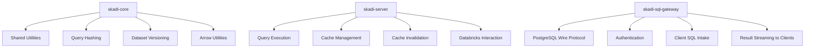
## Responsibilities
### skadi-core
- Contains shared logic and must remain free of:
- network protocol handling
- Spring Boot service behavior
- direct gateway concerns
### skadi-server
Owns:
- execution
- caching
- invalidation
- upstream Databricks interaction
### skadi-sql-gateway
Owns:
- client connectivity
- SQL protocol handling
- translating client requests into execution requests:

## 3. Query Flow
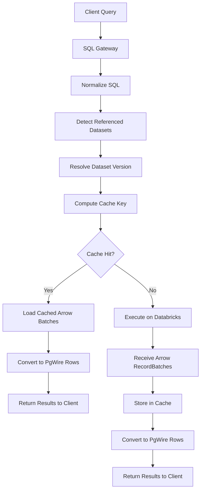
## Query flow summary
Query flow summary
1. Gateway receives SQL from the client.
1. SQL is normalized for deterministic cache-key generation.
1. Referenced datasets are identified.
1. Dataset version is resolved.
1. Cache key is computed from:
   - normalized SQL
   - bound parameters
   - dataset version
1. If cached result exists, it is returned.
1. Otherwise query executes on Databricks and the result is cached.

# 4. Cache Architecture
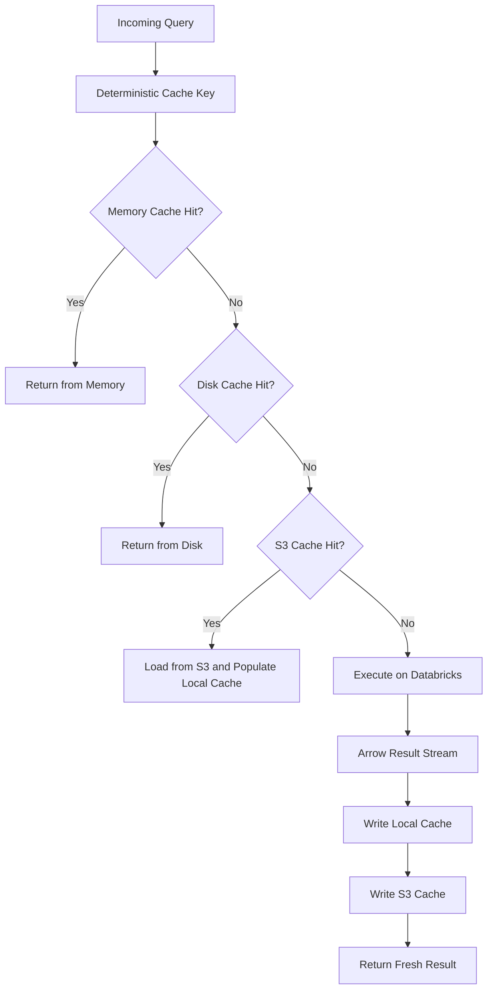
## Cache design principles
- Cache keys must be deterministic.
- Cache correctness depends on dataset versioning.
- Cached results should be stored in Arrow format.
- Local caches optimize latency.
- Shared S3 cache enables reuse across nodes

# 5. Cache Key Composition
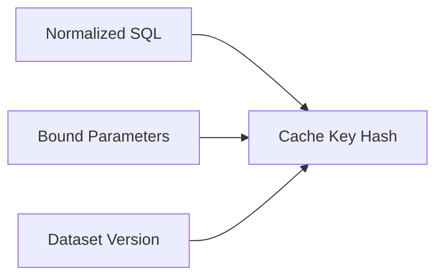
## Formula
The logical cache key is:
```
hash(normalized_sql, parameters, dataset_version)
```
This ensures:
- formatting differences do not fragment cache
- different parameter values do not collide
- stale data is avoided when datasets refresh

# 6. Dataset Versioning Model
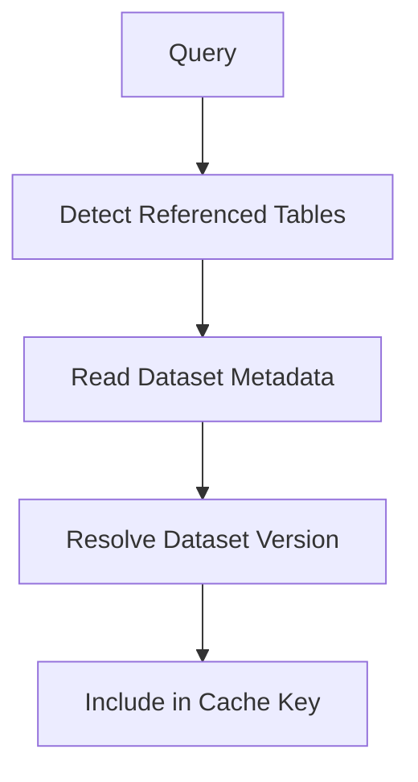
## Itent
Skadi must avoid serving stale data.
For the POC:
- a simple table-level version is acceptable
  For later versions:
- partition-aware versioning should be used for datasets like market risk tables partitioned by COB date
  Example:
- recent COB dates may refresh every 2 hours
- older dates remain stable
# 7. Tableau Connectivity View
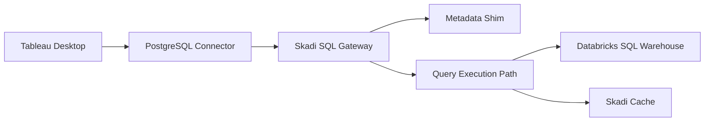
## Tableau-specific notes
The gateway must support:
- authentication
- metadata discovery
- simple query execution
- query cancellation
- row streaming in PostgreSQL wire format
  The gateway does not need to implement all PostgreSQL features.
  It only needs the subset required for BI tools.
# 8. Metadata Compatibility Layer
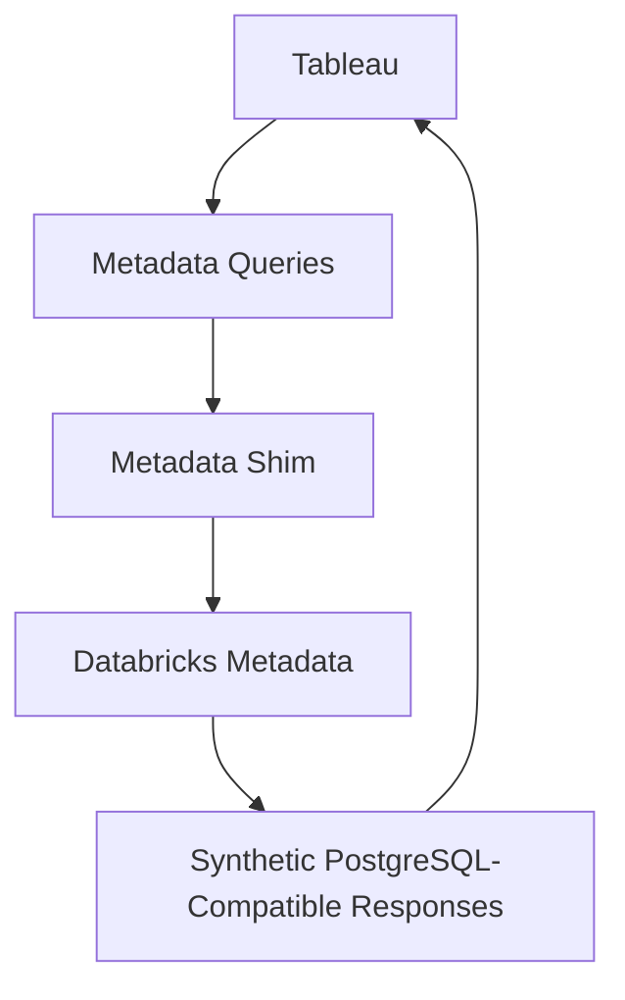
## Expected metadata query families
The gateway should support synthetic responses for:
- information_schema.tables
- information_schema.columns
- pg_catalog.pg_tables
- pg_catalog.pg_namespace
  These may be backed by Databricks metadata rather than native PostgreSQL catalogs.
# 9. Result Conversion Pipeline
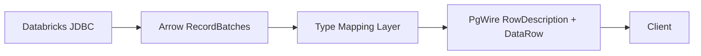
## Purpose
Internally Skadi prefers Arrow because it is efficient for:
- transport
- caching
- analytics interoperability
  Externally the SQL Gateway must emit PostgreSQL wire-protocol row messages.
  This makes Skadi usable by Tableau and other clients.
# 10. Multi-Node Deployment
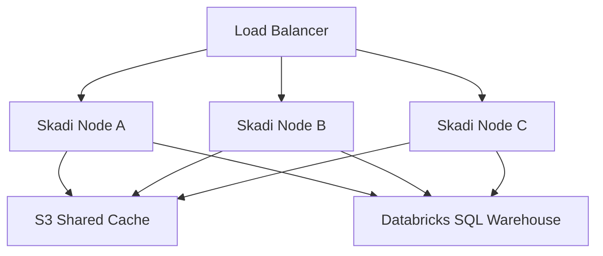
# Multi-node goals
- reuse cache across nodes
- reduce repeated execution against Databricks
- allow horizontal scaling for BI concurrency
  Each node may maintain:
- local memory cache
- local disk cache
  All nodes may optionally share:
- S3 cache
# 11. Concurrent Cache-Miss Control
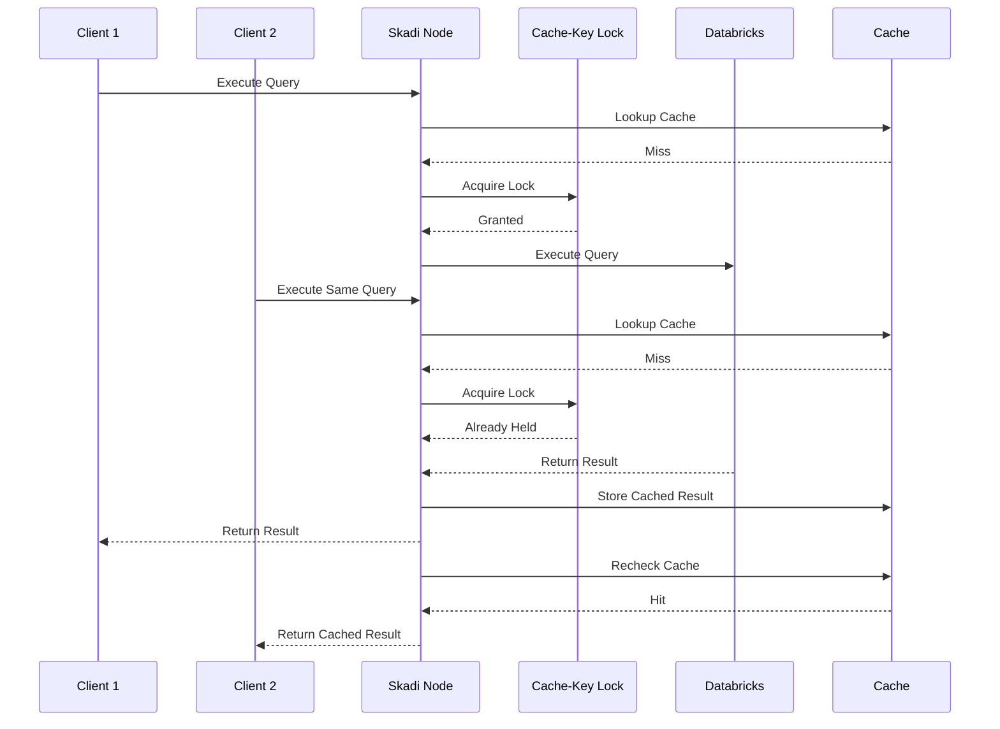
## Purpose
This pattern avoids duplicate execution when multiple users trigger the same dashboard query simultaneously.
# 12. Observability View
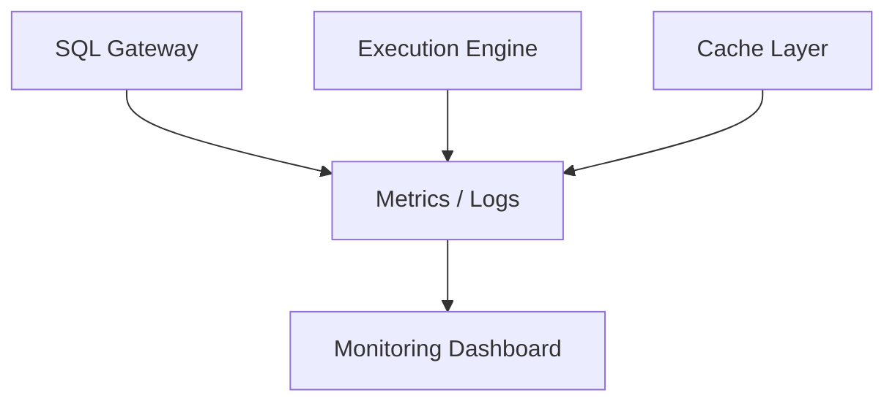
##Important metrics
Track at minimum:
- cache hit rate
- cold vs warm execution time
- Databricks query count
- rows returned
- query failures
- cancellation count
  These are essential both for:
- proving POC value
- operating the platform in production
# 13. POC Success Path

## POC definition of success
1. A successful POC should demonstrate:
1. Tableau can connect using the PostgreSQL connector
1. Metadata browsing works
1. A representative query executes successfully
1. Running the same query again produces a cache hit
1. Warm execution is materially faster than cold execution
# 14. Architecture Guardrails
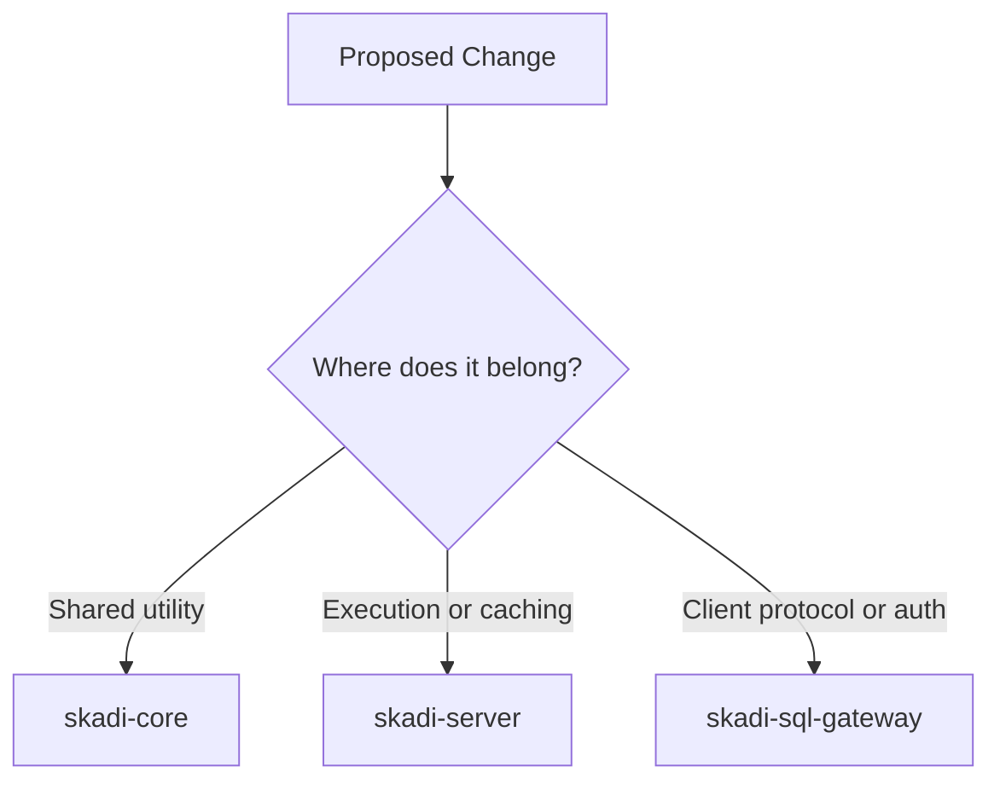
# Guardrails
When evolving the codebase:
- do not put network protocol code into skadi-core
- do not duplicate cache logic between modules
- do not place execution logic in the gateway unless unavoidable
- keep the gateway thin
- keep cache logic protocol-independent

# 15. Summary
Skadi is best understood as five major concerns:
1. **Client Connectivity**    
   PostgreSQL-compatible SQL endpoint for BI tools
1. **Execution**  
   Query execution against Databricks SQL Warehouse
1. **Caching**  
   Deterministic Arrow-based cache across memory, disk, and future S3
1. **Correctness**    
   Query normalization and dataset versioning to prevent stale or fragmented cache
1. **Scalability**  
   Multi-node deployment with shared cache and observability    

This document should be read together with:    
- ai/system-map.md
- ai/query-flow.md
- ai/skadi-cache-architecture.md
- ai/skadi-query-normalization.md
- ai/skadi-dataset-versioning.md
- ai/skadi-node-architecture.md
- ai/tableau-compatibility.md
- ai/tableau-query-patterns.md

