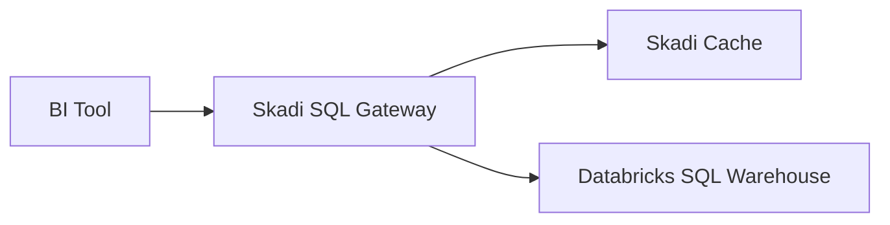
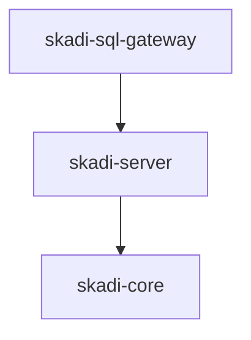
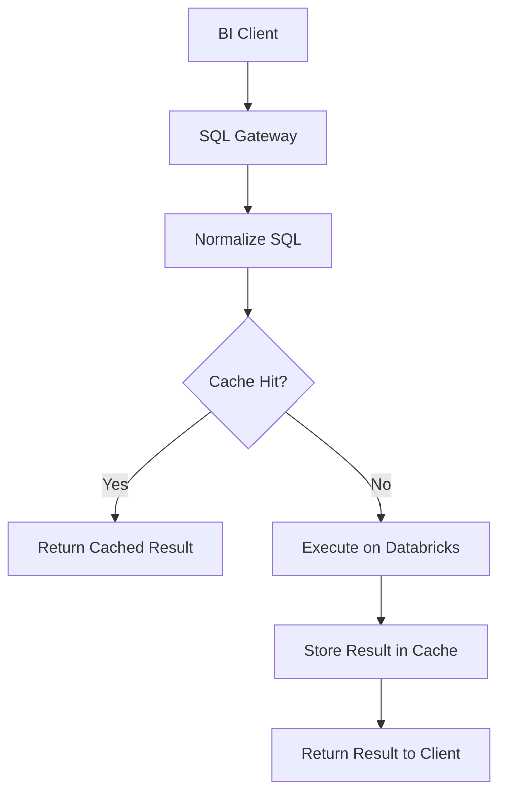
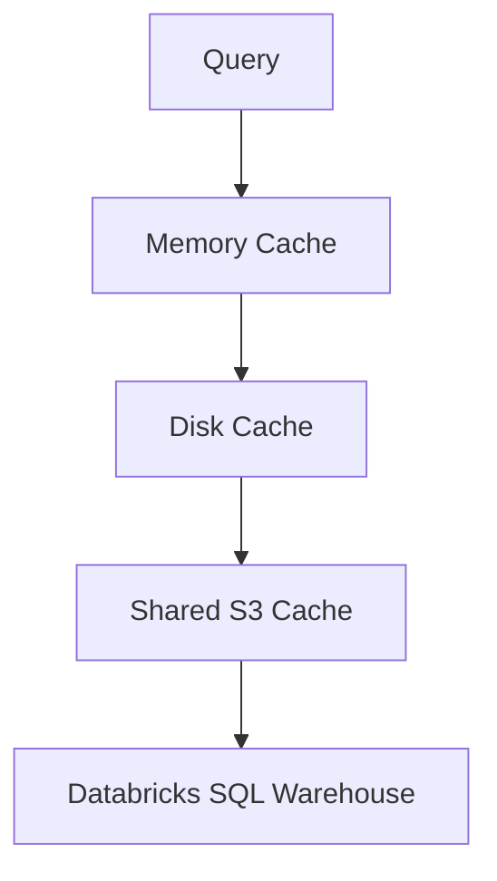
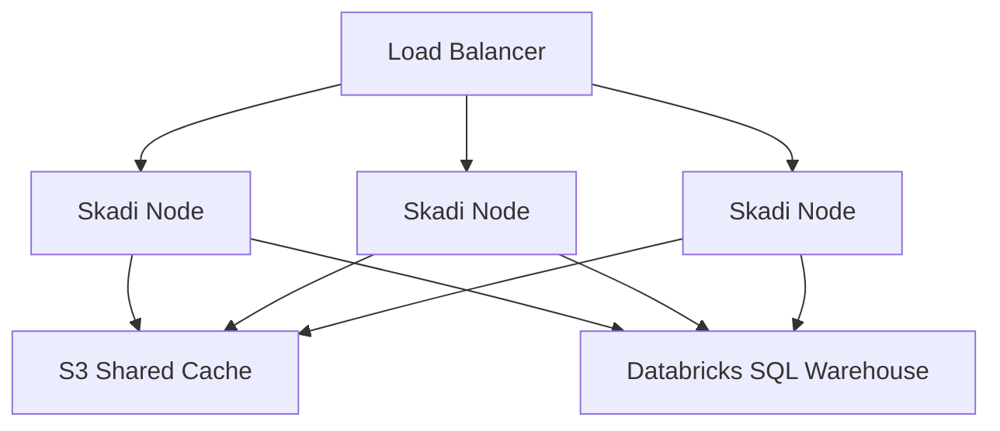
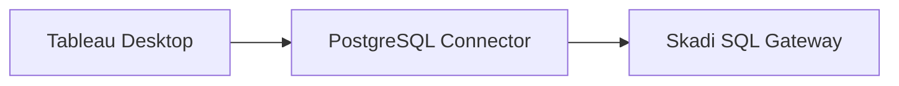

# Skadi Architecture — Executive Overview

Skadi is a **query acceleration and caching layer for analytics workloads** that sit on top of Databricks SQL Warehouse.

It improves BI performance by caching query results and serving repeated queries without re-executing them against the warehouse.

Primary target clients include:

* Tableau
* BI tools using SQL
* JDBC/ODBC analytics clients

---

# Core Value Proposition

Typical BI dashboards execute the same queries repeatedly.

Without Skadi:


Each dashboard refresh triggers expensive queries.

With Skadi:



Skadi intercepts queries and returns cached results when possible.

Benefits:

* faster dashboards
* reduced Databricks compute load
* lower operational cost

---

# System Components

Skadi consists of three primary modules.



### skadi-sql-gateway

Provides SQL connectivity for clients.

Responsibilities:

* PostgreSQL-compatible wire protocol
* authentication
* SQL intake
* streaming results to clients

---

### skadi-server

Execution and caching engine.

Responsibilities:

* query execution against Databricks
* Arrow-based result streaming
* cache management
* cache invalidation

---

### skadi-core

Shared infrastructure used by other modules.

Responsibilities:

* query normalization
* cache key hashing
* dataset versioning
* Arrow utilities

---

# Query Execution Model

Query flow through Skadi:



Key design principles:

* deterministic cache keys
* Arrow-based caching
* minimal protocol translation

---

# Cache Strategy

Cache entries are generated from:

```text
hash(normalized_sql, parameters, dataset_version)
```

This ensures:

* formatting differences do not fragment the cache
* different parameter values produce unique entries
* cached results invalidate when datasets change

---

# Performance Model

Example dashboard query:

```sql
SELECT cob_date, SUM(pnl)
FROM mxl.gold_risk
GROUP BY cob_date
```

Typical behavior:

| Execution              | Time           |
| ---------------------- | -------------- |
| Cold run (Databricks)  | ~15–20 seconds |
| Warm run (Skadi cache) | ~1–3 seconds   |

This dramatically improves BI responsiveness.

---

# Cache Architecture

Skadi supports a multi-layer cache hierarchy.



Benefits:

* low latency for repeated queries
* shared cache across nodes
* scalable for large deployments

---

# Multi-Node Deployment

Production environments typically run multiple Skadi nodes.



This architecture enables:

* horizontal scaling
* shared caching
* high concurrency support

---

# BI Tool Compatibility

Skadi exposes a **PostgreSQL-compatible SQL endpoint**.

This allows tools such as Tableau to connect using existing connectors.



The gateway implements only the subset of PostgreSQL behavior required for BI connectivity.

---

# Key Design Principles

Skadi follows several architectural principles.

1. **Protocol Adaptation**

   The SQL gateway translates client protocols without implementing a full database engine.

2. **Arrow-Native Caching**

   Query results are stored in Arrow format for efficient streaming.

3. **Deterministic Cache Keys**

   Cache keys combine normalized SQL, parameters, and dataset version.

4. **Thin Gateway Layer**

   Network protocols are separated from execution logic.

5. **Distributed Cache Support**

   Shared S3 cache enables reuse across multiple nodes.

---

# Target Use Cases

Skadi is designed for environments where:

* large analytical queries are repeatedly executed
* BI dashboards refresh frequently
* warehouse compute costs are significant

Typical environments include:

* financial risk analytics
* data lakehouse BI workloads
* enterprise analytics platforms

---

# Summary

Skadi sits between BI tools and Databricks SQL Warehouse to provide:

* SQL compatibility
* query result caching
* performance acceleration

It acts as a **transparent performance layer** for analytical workloads.
