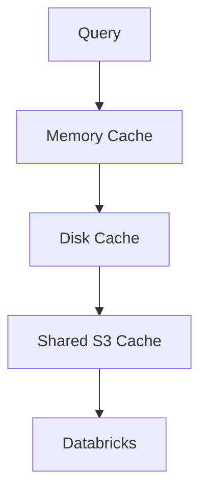

# Cache Architecture

Skadi caches query results using a deterministic cache key.

cache_key = hash(normalized_sql, parameters, dataset_version)

Cached results are stored in Arrow format.

Advantages:

- efficient streaming
- columnar storage
- compatibility with analytics workloads

## Cache Layers

