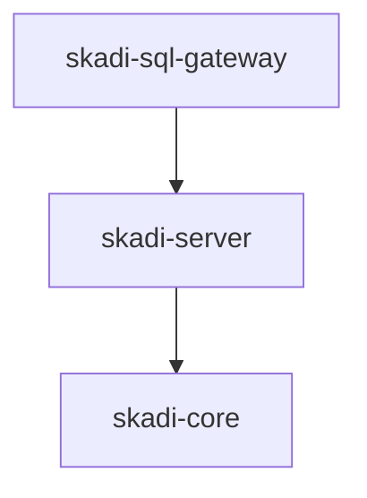

# System Components

Skadi is organized into three modules.

## skadi-sql-gateway

Provides SQL connectivity.

Responsibilities:

- PostgreSQL wire protocol
- client authentication
- SQL query intake
- result streaming

## skadi-server

Execution engine.

Responsibilities:

- execute queries against Databricks
- manage query caching
- stream Arrow results
- handle cache invalidation

## skadi-core

Shared infrastructure.

Responsibilities:

- query normalization
- cache key hashing
- dataset versioning
- Arrow utilities
