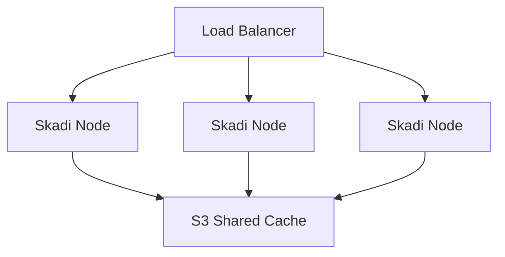

# Distributed Architecture

Production deployments run multiple Skadi nodes.

```mermaid
flowchart TD
    LB[Load Balancer]
    LB --> Node1[Skadi Node]
    LB --> Node2[Skadi Node]
    LB --> Node3[Skadi Node]

    Node1 --> S3[S3 Shared Cache]
    Node2 --> S3
    Node3 --> S3
```
