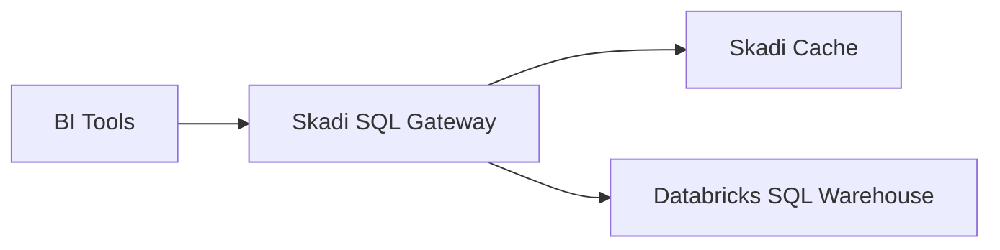

# Architecture Overview

Skadi sits between BI tools and Databricks SQL Warehouse.

The system intercepts SQL queries and determines whether a cached result
can be returned.

If the query result is cached:

- Skadi returns cached Arrow results.

If the result is not cached:

- the query executes on Databricks
- results are streamed and cached.

## Benefits

- faster BI dashboards
- reduced warehouse load
- improved cost efficiency
