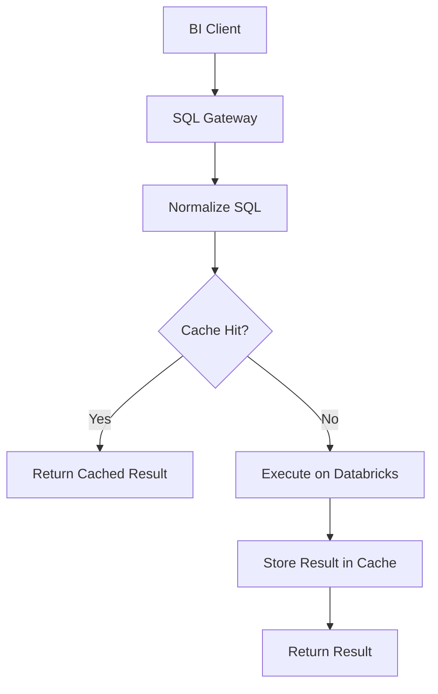

# Query Flow

```mermaid
flowchart TD
    Client[BI Client] --> Gateway[SQL Gateway]
    Gateway --> Normalize[Normalize SQL]
    Normalize --> CacheLookup{Cache Hit?}

    CacheLookup -- Yes --> ReturnCache[Return Cached Result]

    CacheLookup -- No --> Execute[Execute on Databricks]
    Execute --> StoreCache[Store Result in Cache]
    StoreCache --> ReturnClient[Return Result]
```
