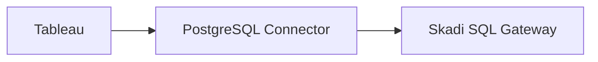

# SQL Gateway

Skadi exposes a PostgreSQL-compatible SQL endpoint.

The gateway implements only the subset of PostgreSQL protocol required for:

- authentication
- metadata discovery
- query execution
- result streaming
- query cancellation
